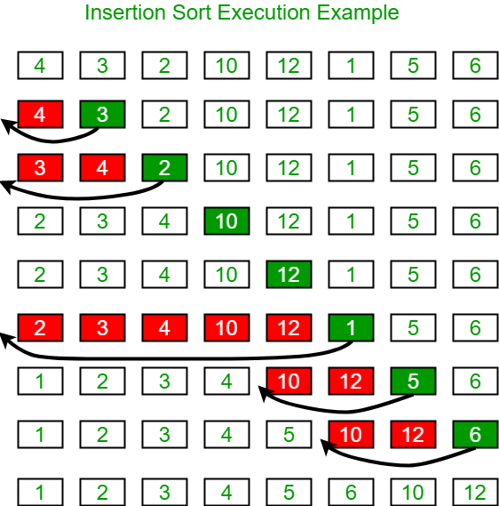
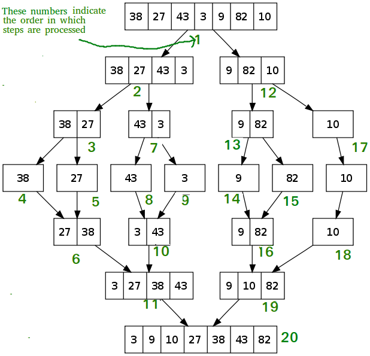
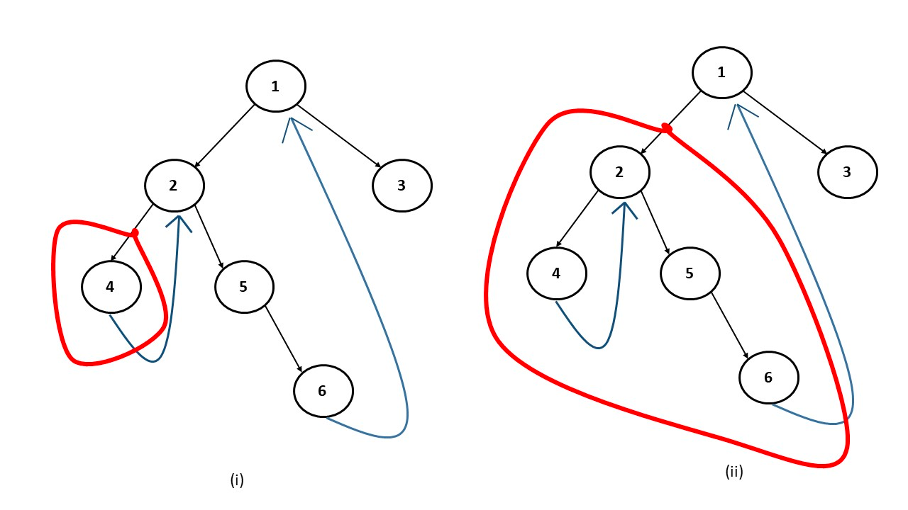
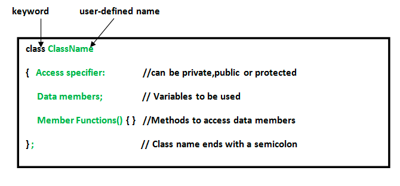

<!-- TOC -->
* [Searching Algo](#searching-algo)
  * [Linear search](#linear-search)
  * [Binary search](#binary-search)
  * [Jump Search](#jump-search)
  * [Interpolation search \- check again](#interpolation-search---check-again)
  * [Exponential search	\- check again](#exponential-search---check-again)
  * [Sublist search	\- check again](#sublist-search---check-again)
* [Sorting Algo](#sorting-algo)
  * [Selection sort](#selection-sort)
  * [Bubble sort](#bubble-sort)
  * [Insertion sort](#insertion-sort)
  * [Merge sort](#merge-sort)
  * [Quick Sort](#quick-sort)
  * [Heap sort](#heap-sort)
* [Data Structures](#data-structures)
  * [Arrays](#arrays)
  * [Linked List](#linked-list)
  * [Strings](#strings)
  * [Stack ( mostly done)](#stack--mostly-done)
  * [Queues](#queues)
  * [Hashing](#hashing)
  * [Maps \- map, set](#maps---map-set)
  * [Heaps](#heaps)
  * [Binary Tree](#binary-tree)
  * [Binary Search Tree(gfg done)](#binary-search-treegfg-done)
  * [Graph](#graph)
    * [Introduction, DFS and BFS](#introduction-dfs-and-bfs)
    * [Cycle](#cycle)
    * [Topological sorting](#topological-sorting)
    * [Minimum Spanning tree](#minimum-spanning-tree)
    * [Backtracking](#backtracking)
    * [Shortest path](#shortest-path)
    * [Connectivity](#connectivity)
  * [Bit Manipulation](#bit-manipulation)
  * [Backtracking](#backtracking-1)
  * [Greedy Algorithm](#greedy-algorithm)
  * [DP](#dp)
  * [Trie](#trie)
* [Others](#others)
  * [Class in C++](#class-in-c)
  * [C++ & C\# DS Comaprison](#c--c-ds-comaprison)
  * [C++ data type size](#c-data-type-size)
  * [Things to remember](#things-to-remember)
<!-- TOC -->

# Searching Algo

[geeksforgeeks](https://www.geeksforgeeks.org/searching-algorithms/?ref=ghm)

## Linear search

- O(n), simple

## Binary search

- O(logn), needs to be sorted
- Implementation \- recursive and iterative
- As we know kth element is 1,  So , 1=n/(2^k) \=\> k=log(n)

## Jump Search

- Jump m times
- Optimum jump size minimum value of n/m+(m-1) \=\> sqrt(m)
- O( sqrt(n)) for sorted array

## Interpolation search \- check again

- Best \- o(log(logn))
- Worse \- o(n)

## Exponential search	\- check again

- o(logn)

## Sublist search	\- check again

- O (m\n)
- Rest skipped

# Sorting Algo

## Selection sort

The selection sort algorithm sorts an array by repeatedly finding the minimum element (considering ascending order) from unsorted part and putting it at the beginning

void selectionSort(int arr\[\], int n)  
{  
    int i, j, min\_idx;  

    // One by one move boundary of unsorted subarray  
    for (i \= 0; i \< n-1; i++)  
    {  
        // Find the minimum element in unsorted array  
        min\_idx \= i;  
        for (j \= i+1; j \< n; j++)  
        if (arr\[j\] \< arr\[min\_idx\])  
            min\_idx \= j;  

        // Swap the found minimum element with the first element  
        swap(\&arr\[min\_idx\], \&arr\[i\]);  
    }  
}
## Bubble sort

Bubble Sort is the simplest sorting algorithm that works by repeatedly swapping the adjacent elements if they are in wrong order.

// A function to implement bubble sort  
void bubbleSort(int arr\[\], int n)  
{  
    int i, j;  
    for (i \= 0; i \< n-1; i++)    
      
    // Last i elements are already in place  
    for (j \= 0; j \< n-i-1; j++)  
        if (arr\[j\] \> arr\[j+1\])  
            swap(\&arr\[j\], \&arr\[j+1\]);  
}
## Insertion sort

The array is virtually split into a sorted and an unsorted part. Values from the unsorted part are picked and placed at the correct position in the sorted part.



Function to sort an array using insertion sort

void insertionSort(int arr\[\], int n)  
{  
    int i, key, j;  
    for (i \= 1; i \< n; i++)  
    {  
        key \= arr\[i\];  
        j \= i \- 1;  

        /\ Move elements of arr\[0..i-1\], that are  
        greater than key, to one position ahead  
        of their current position \/  
        while (j \>= 0 && arr\[j\] \> key)  
        {  
            arr\[j \+ 1\] \= arr\[j\];  
            j \= j \- 1;  
        }  
        arr\[j \+ 1\] \= key;  
    }  
}
## Merge sort



Time Compexity \- T(n) \= 2T(n/2)+Theta(n) \=\> O(nlogn) in all case  
Space complexity \- o(n)  
[Sorting\_Merge\_Sort](https://docs.google.com/document/d/1AYbPXgcxxtZ5BUlXsdTIMrCs8uluWQ9NoVdXiWy7DPw/edit)
Checkout Merge sort for linked list

## Quick Sort


Time complexity , t(n) \= t(k)+t(n-k)+theta(n)  
Avg \-nlogn , best \- nlogn, worse- n2  
Pseudo code understood  
Implementation done
## Heap sort

- Do after understanding binary heap data structure
- Time complexity - nlogn
- Insert element in heap - logn
- Delete element ( only topmost can be removed) - logn
- Create heap - nlogn
- Heap sort
  - Create heap
  - Delete all element
- Heapify - O(n)
- [https://www.youtube.com/watch?v=HqPJF2L5h9U](https://www.youtube.com/watch?v=HqPJF2L5h9U)
- Check insertion in heap \- bottom up approach \- done

# Data Structures

## Arrays

 Pointers
    Int var = 10;
    Int *ptr = &var;
    Var -10, ptr - 100, *ptr  = 10;
## Linked List

Stl - list -> front(),back(),push_back(),push_front()
Definition 
class node{
    int val;
    node *next;
    Node(int x){
        Val = x; 
        }
    }
Doubly linked list
    Practice done
Floyd Cycle Finding Algo 
    https://www.geeksforgeeks.org/floyds-cycle-finding-algorithm/
## Strings

Find
    String s
    s.find(string delim, start) => returns starting index of delim if not found returns -1
SubString
    string substr (size_t pos, size_t len) 
## Stack ( mostly done)

Syntax   
    Stack <dt> st;  
    st.push(a),st.pop(),st.top()st.size(),st.empty()  

Design and Implementation  
    Implement queue using stack - sl  
        Enqueue or dequeu has to be o(n)  
    Design and Implement Special Stack Data Structure | Added Space Optimized Version \- not important  
    Implement two stacks in an array  
        Create stack from extreme corners   
    Implement stack using queue  
        Push or pop has to be o(n)  

Standard Problems on stack  
    Infix to postfix - check later  
    Stock span problem - sl, end  
    Balanced parentheses - sl, end  
    Next greater element - sl, end  

Operation on stack  
   Reverse a stack using recursion
## Queues

queue<dt>;  
q.push(a),q.front(),q.back(),q.pop(),size,empty  
Deque   
    Push_back, pop_back, push_front, pop_front
## Hashing

 1. Unorderd\_set, Unorederd\_map
## Maps \- map, set

 1. Based on red lack tree ( balanced binary tree)  
 2. Multiset \- duplicate value can be stored
## Heaps

 1. Syntax  
    1. priority\_queue\<int\> \-max heap first element largest, priority\_queue\<int,vector\<int\>, greater\<int\>,\> \- min heap, first element smallest  
    2. Push, pop,top,size,empty,swap  
    3. Heapify \- check later, logic understood , practice remaining \- done  
    4. Custom comparator for priority queue  
 2. Time complexity  
    1.  Insert,delete \- o(log(n)), peek \- O(1)  
 3. Binary Heap  
    1. Complete binary tree \- all position filled from left
## Binary Tree

 1. Minimum possible height \- log(n+1)  
 2. Transversal  
    1. DFS \- In,pre,post  
        Tc \- O(N), AS \- O(h)  
    2. BFS / Level order  
        TC- O(N), sc \- o(n)  
    3. Morris inorder  
        O(n) sc- O(1)  
        
 3. Introduction  
    1. Properties  
        Maximum number of nodes at level l is 2\\l;  
        Maximum no of nodes in binary tree of height h is 2\\h \-1  
        Minimum height of binary tree with n node is log2(n+1)  
        Binary tree with l leaves has at least log2(l)+1 level  
        In Binary tree where every node has 0 or 2 children, the number of leaf nodes is always one more than nodes with two children  
        No of edge \= no of node \-1, root has no edge  
    2. Type  
        Full binary tree \- either 0 or 2 children  
        Complete binary tree \- all levels completely filled except last level  
        Perfect binary tree \- A Binary tree is a Perfect Binary Tree in which all the internal nodes have two children and all leaf nodes are at the same leve  
        Balanced binary tree \- if height \= log(n)  
        Degenerate or (pathological tree) \- tree where very internal node has one child  
    3. Handshaking Lemma and Interesting Tree Properties \- skipped  
    4. Enumeration of tree   
        Nth catalan number \- T(n)=\\sum\_{i=0}^{n-1}T(i)\T(n-i-1) \\ for \\ n\\geq 1;                               
        Unlabeled tree \- T(n) \= (2n)\! / (n+1)\!n\!  
        Labeled tree \- T(n) \= (2n)\! / (n+1)\!  
    5. Insert node  
        Bfs until we find node with either left or right child empty  
        Insert new node there  
    6. Delete node  
    7. BFS vs DFS  
        Time complexity  \- O(n) n \= no. of node  
        Space complexity  
          Dfs- o(height)  
          BFS \- o (weight)  
    8. Binary tree, array implementation  
    9. AVL with duplicate keys \- check later  
 4. Traversals  
    1. Trasvaersals  
    2. Inorder without recursion , using stack \- check later  
    3. Inorder without recursion and stack , morris traversal, check later  
    4. Create postorder from in and pre \- sl  
    5. Create post order from preorder \- sl  
    6. Find all possible binary tree with given inorder traversal \- check later  
 5. Construction and conversion  
    1. Construct tree from inorder and preorder
## Binary Search Tree(gfg done)

  1. Properties  
     1. All left node smaller and right node greater than parent for each n  
     2. No duplicate nodes allowed  
  2. Basic  
     1. Search and Insertion	  
         Brute force  
     2. Delete   
         Simple if node has 0 or 1 node  
         If node has 2 node, replace with inorder successor  
     3. Advantage of BST over Hash  
         In range queries  
  3. Construction and Conversion  
     1. Convert bst from preorder transversal  
         Using stack  
         Using recursion, range \- check later  
     2. Bst from binary tree  
         1\) Create a temp array arr\[\] that stores inorder traversal of the tree. This step takes O(n) time.  
         2\) Sort the temp array arr\[\]. Time complexity of this step depends upon the sorting algorithm. In the following implementation, Quick Sort is used which takes (n^2) time. This can be done in O(nLogn) time using Heap Sort or Merge Sort.  
         3\) Again do inorder traversal of tree and copy array elements to tree nodes one by one. This step takes O(n) time.  
     3. Sorted Linked List to BST  
         Do in O(n)  
     4. Sorted Array to BST (easy implementation not done)  
     5. Transverse bst to grater sum tree (imp not done)  
         Use reverse order transversal  
  4. Checking and Searching  
     1. Minimum value in BST  
     2. Check if the given array can represent Level Order Traversal of Binary Search Tree check later  
     3. Check if a given array can represent Preorder Traversal of Binary Search Tree check later  
     4. Lowest common ancestor of two nodes in BST \- sl learnt
## Graph

### Introduction, DFS and BFS

 1. Representations \-  
      Adjacency list  
       {vertex}{edges}  
       0 \-\> 1,2  
       1-\> 2  
       2 \-\> 0,3  
       3 \-\> 4   
      Adjacency matrix  
 2. BFS \- using queue  
     Pseudo code  
     Tc- o(v+e), auxiliary space \- O(v)  
       v1 \+ (incident edges) \+ v2 \+ (incident edges) \+ .... \+ vn \+ (incident edges)  
     Handling disconnected graph  
       Just to modify BFS, perform simple BFS from each unvisited vertex of given graph.  
 3. DFS \- using recursion, same as tree  
     Pseudo code   
       dfs(vector\<vector\<int\>\> v, vertex, visited){  
           for edge in vertex:  
               vertexTemp \= edge-\> vertex  
               if vertexTemp not visited:  
                   print(vertexTemp)  
                   visited\[vertexTemp\] \= true;  
               dfs(v, vertexTemp, visited);  
       }

     Tc \- O(v+e) sc \- O(v)  
     Handling disconnected graph  
       perform simple BFS from each unvisited vertex of given graph.

 4. DFS Application  
     Cycle detection \- direct , indirect  
     Path finding   
     Topological sorting   
 5. BFS Application   
     Shortest path and minimum spanning tree for unweighted graph  
 6. Representation using set and hash  
 7. Auxiliary space complexity vs space complexity  
     Auxiliary space complexity \- Use by compute like function Stack  
     Space complexity \= Auxiliary space complexity \+ Use by variable
### Cycle

 1. Detect cycle in undirected graph  
     Dfs and using visited  
       Run a Depth First Traversal on the given subgraph connected to the current node and pass the parent of the current node. In each recursive   
         Set visited\[root\] as 1\.  
         Iterate over all adjacent nodes of the current node in the adjacency list   
         If it is not visited then run DFS on that node and return true if it returns true.  
         Else if the adjacent node is visited and not the parent of the current node then return true.  
         Return false.  
     BFS  
       Start BFS traversal from each unvisited node in the graph.  
       While traversing, mark each visited node.  
       If a node is encountered that is already marked as visited, it implies the presence of a cycle.  
       Continue BFS traversal until all nodes are visited or a cycle is detected.  
 2. Detect cycle in directed graph  
     Dfs using visited and recStack  
       Create a recursive dfs function that has the following parameters – current vertex, visited array, and recursion stack .  
       Mark the current node as visited and also mark the index in the recursion stack.  
       Iterate a loop for all the vertices and for each vertex, call the recursive function if it is not yet visited (This step is done to make sure that if there is a forest of graphs, we are checking each forest):  
       In each recursion call, Find all the adjacent vertices of the current vertex which are not visited:  
       If an adjacent vertex is already marked in the recursion stack then return true .  
       Otherwise, call the recursive function for that adjacent vertex.  
       While returning from the recursion call, unmark the current node from the recursion stack, to represent that the current node is no longer a part of the path being traced.  
       If any of the functions returns true , stop the future function calls and return true as the answer.  
     Using BFS \- Skipped
### Topological sorting

 1. Topological sorting  
     Directed acyclic graph (DAGs)  
     Using stack and visited, and dfs  
       Create a graph with n vertices and m-directed edges.  
       Initialize a stack and a visited array of size n.  
       For each unvisited vertex in the graph, do the following:  
         Call the DFS function with the vertex as the parameter.  
         In the DFS function, mark the vertex as visited and recursively call the DFS function for all unvisited neighbors of the vertex.  
       Once all the neighbors have been visited, push the vertex onto the stack.  
       After all, vertices have been visited, pop elements from the stack and append them to the output list until the stack is empty.  
       The resulting list is the topologically sorted order of the graph.  
     Using BFS \- Skipped
### Minimum Spanning tree

 1. Definition  
     Graph \- weighted and undirected and connected  
     Spanning Tree Definition \-  Convert graph to tree with n vertices and n-1 edges and all nodes are reachable from each other  
     Minimum Spanning Tree Definition \- Cumulative weight should be minimum  
 2. Prim’s Algo   
 3. Kruskal algo & Union Find ❎
### Backtracking

 1. Find if there is a path of more than k length from a source   
     Implementation pending ❎
### Shortest path

 1. Dijkstra algo  
     Tc \- o(v^2)  
     Work on both directed and undirected graph  
     Does not work for negative edge  
     Algo  
       Maintain a visited node and distance array  
       Select node with minimum distance from distance array which is not visited and update its neighbour distance if lesser  
       Do it V no of times as we want to visit all V vertex  
     Optimisation  
       Use Priority queue for finding minimum distance  
       TC \- O(Vlog(v))  
 2. Bellman ford ❎  
     DG \- except negative cycle  
     UG \- only for positive number  
     Algo  
       Initialize distance array  
       Do relaxation v-1 times  
         if(dist\[u\]+w\<dist\[v\]) \=\> dist\[v\] \= dist\[u\]+w  
       TC \- O(v\e), sc- o(v)  
 3. Floyd Marshal ❎  
     To find shortest distance between every poor  
     Tc- O(n^3)  
     Revise algo
### Connectivity

 1. Find if there is a path between two vertices in a directed graph  
     Bfs or dfs   
 2. Strongly connected graph ❎  
     Kosaraju algo  
       Stack of order dfs transversal  
       Reverse all edge direction by taking transpose  
       Do dfs again
## Bit Manipulation

1. Operator
   1. AND (&) \-\>  1 if both 1
   2. OR (|) \-\>1 if atleast 2
   3. XOR (^) \-\> 1 if only one 1
   4. NOT (\~) \-\> Invert all bits
   5. Left Shift (\<\<) \-\> Shift bit to left , filling with zeros
   6. Right shift (\>\>) \-\> shift bit to right, filling with zeros

## Backtracking

1. Brute force approach for all possible combination
2. Used when greedy or dp does not work
3. TC \- O(k^N) OR O(k\!)
4. Pseudo Code
   ```void
       if (valid solution):  
       store the solution  
       Return  
       for (all choice):  
         if (valid choice):  
           APPLY (choice)  
           FIND\_SOLUTIONS (parameters)  
           BACKTRACK (remove choice)  
       Return ```


   ```

## Greedy Algorithm

1. The steps to define a greedy algorithm are:
   1. Define the problem: Clearly state the problem to be solved and the objective to be optimized.
   2. Identify the greedy choice: Determine the locally optimal choice at each step based on the current state.
   3. Make the greedy choice: Select the greedy choice and update the current state.
   4. Repeat: Continue making greedy choices until a solution is reached.
2. When should I use a greedy algorithm?
   1. Greedy algorithms are best suited for problems where optimal substructure exists. This means that the optimal solution to the problem can be constructed from the optimal solutions to its subproblems. Examples of problems where greedy algorithms are effective include Dijkstra’s shortest path algorithm, Kruskal’s minimum spanning tree algorithm, and Huffman coding .

## DP

1. Cheatsheet
2. Set 1
   1. Maximum product subarray \-
      Maintain product from left and right
   2. Longest increasing subsequence \-
      Two pointer from start
   3. Longest common subsequence \- check later \-
   4. 0-1 Knapsack \-
      Check later
      Top down and bottom up approach
3. Set 2
   1. Minimum path sum \- done
   2. Coin change \- done

## Trie

1. Part  I
   1. feature
      Insert(word)
      search(word)
      startsWith(word)
   2. [https://www.youtube.com/watch?v=dBGUmUQhjaM](https://www.youtube.com/watch?v=dBGUmUQhjaM)
2. Part II
   1. [https://www.youtube.com/watch?v=K5pcpkEMCN0](https://www.youtube.com/watch?v=K5pcpkEMCN0)
   2. feature
      Insert(word)
      countSearch(word)
      countStartsWith(word)
      erase(word)
   3.
3. [https://www.youtube.com/watch?v=RV0QeTyHZxo\&list=PLgUwDviBIf0pcIDCZnxhv0LkHf5KzG9zp\&index=4](https://www.youtube.com/watch?v=RV0QeTyHZxo\&list=PLgUwDviBIf0pcIDCZnxhv0LkHf5KzG9zp\&index=4)
   1. Do this playlist

# Others

## Class in C++



```C++

    #include <bits/stdc++.h>
    using namespace std;
    class Geeks
    {
        public:
        int id;
      
        //Default Constructor
        Geeks()
        {
            cout << "Default Constructor called" << endl;
            id=-1;
        }
      
        //Parameterized Constructor
        Geeks(int x)
        {
            cout << "Parameterized Constructor called" << endl;
            id=x;
        }
    };
    int main() {
      
        // obj1 will call Default Constructor
        Geeks obj1;
        cout << "Geek id is: " <<obj1.id << endl;
      
        // obj1 will call Parameterized Constructor
        Geeks obj2(21);
        cout << "Geek id is: " <<obj2.id << endl;
        return 0;
    }
```
## C++ & C\# DS Comaprison


| C++                                                      | C\#                                       | Java                                           |
| :------------------------------------------------------- | :---------------------------------------- | :--------------------------------------------- |
| vector\<int\>, push\_back,size,pop\_back                 | List\<int\> , add,count,list.sort(),      | ArrayList\<int\> , add, get, set               |
| Linked list\- custom, list stl                           | Linkedlist\<t\>                           | LinkedList, addFirst, addLast                  |
| Strings                                                  | string                                    | string                                         |
| Stacks ,st.push(a),st.pop(),st.top()st.size(),st.empty() | Stack, push(), pop(),peek()               | Stack, push,pop,isEmpty                        |
| Queues,q.push(a),q.front(),q.back(),q.pop(),size,empty   | Queue, enqueue, dequeue, peek             | LinkedList                                     |
| Hashing\- unordered\_set, unorderer\_map                 | Hashset- Add ,remove, dictionoary         | HashSet,add,contains,remove                    |
| Maps\- map, set                                          | Sortedset\- Add ,remove, sortedDictionary | HashMap\<int,int\> hm, hm.put(“1”,”2”),get |
| Heap\- priority queue                                    | Priority queue\- check later              |                                                |
| tree                                                     |                                           |                                                |
| graph                                                    |                                           |                                                |
| cout\<\<” “\<\<endl; cin\>\>endl;                      | Console.writeLine();Console.ReadLine()    | System.out.println();                          |

## C++ data type size


| Data Type              | Size (in bytes) |              Range              |
| ---------------------- | :-------------: | :------------------------------: |
| short int              |        2        |        \-32,768 to 32,767        |
| unsigned short int     |        2        |           0 to 65,535           |
| unsigned int           |        4        |        0 to 4,294,967,295        |
| int                    |        4        | \-2,147,483,648 to 2,147,483,647 |
| long int               |        4        | \-2,147,483,648 to 2,147,483,647 |
| unsigned long int      |        4        |        0 to 4,294,967,295        |
| long long int          |        8        |       \-(2^63) to (2^63)-1       |
| unsigned long long int |        8        | 0 to 18,446,744,073,709,551,615 |
| signed char            |        1        |           \-128 to 127           |
| unsigned char          |        1        |             0 to 255             |
| float                  |        4        |                                  |
| double                 |        8        |                                  |
| long double            |       12       |                                  |
| wchar\_t               |     2 or 4     |         1 wide character         |

## Things to remember

vector\<int\> v; v.size()-1 will give a large number because v.size() is type of unsigned integer.  
Correction \- (int)v.size()-1
