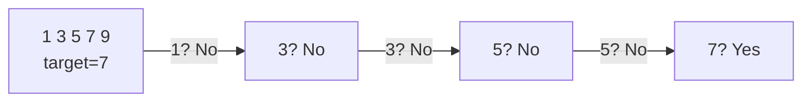
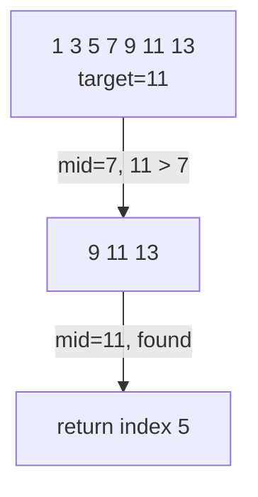
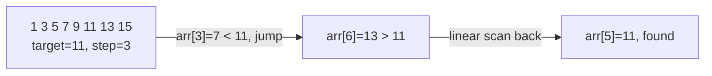
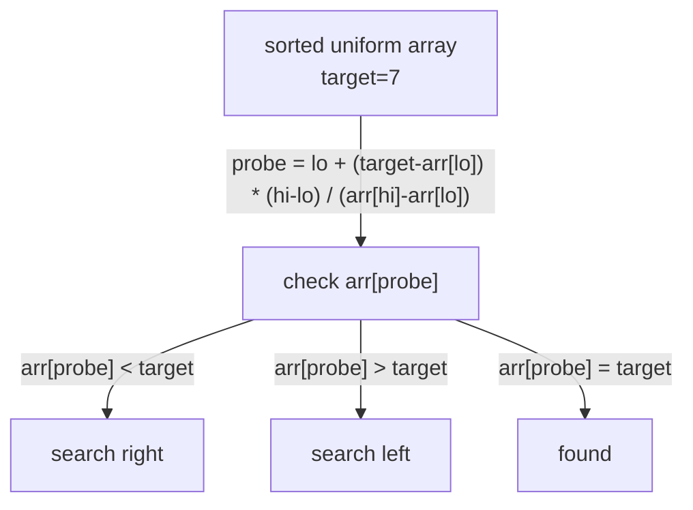
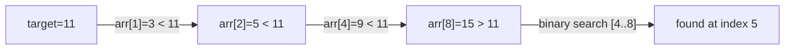

# Searching Algorithms

| Algorithm            | Best | Average      | Worst  | Space | Requires Sorted |
|----------------------|------|--------------|--------|-------|-----------------|
| Linear Search        | O(1) | O(n)         | O(n)   | O(1)  | No              |
| Binary Search        | O(1) | O(log n)     | O(log n) | O(1) | Yes            |
| Jump Search          | O(1) | O(√n)        | O(√n)  | O(1)  | Yes             |
| Interpolation Search | O(1) | O(log log n) | O(n)   | O(1)  | Yes (uniform)   |
| Exponential Search   | O(1) | O(log n)     | O(log n) | O(1) | Yes            |

Reference: [GeeksForGeeks — Searching Algorithms](https://www.geeksforgeeks.org/searching-algorithms/?ref=ghm)

---

## Linear Search

Scans each element sequentially until the target is found or the array ends.

- Time: O(n) — Space: O(1)
- Works on unsorted data

---

## Binary Search

Repeatedly halves the search range by comparing the target to the middle element. Array must be sorted.

- Time: O(log n) — Space: O(1)
- Derivation: after k steps, 1 element remains → k = log(n)
- Can be implemented recursively or iteratively

---

## Jump Search

Jumps ahead by a fixed block size √n, then does a linear scan backwards once the target range is found.

- Time: O(√n) — Space: O(1)
- Optimal block size: √n minimises total steps (n/m + m−1)

---

## Interpolation Search

Estimates the probe position using the value distribution, similar to how humans search a phonebook.

- Best/avg: O(log log n) on uniformly distributed data
- Worst: O(n) when data is heavily skewed

---

## Exponential Search

Finds the range where the target may exist by doubling the index, then runs binary search within that range. Useful for unbounded or infinite arrays.

- Time: O(log n) — Space: O(1)
- Particularly useful when the array is unbounded (size unknown)
