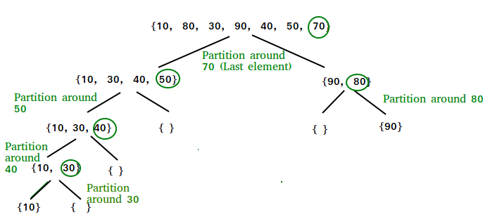

# Sorting Algo

## Selection sort

The selection sort algorithm sorts an array by repeatedly finding the minimum element (considering ascending order) from unsorted part and putting it at the beginning

```c++
void selectionSort(int arr[], int n)  
{  
    int i, j, min_idx;  

    // One by one move boundary of unsorted subarray  
    for (i = 0; i < n-1; i++)  
    {  
        // Find the minimum element in unsorted array  
        min_idx = i;  
        for (j = i+1; j < n; j++)  
        if (arr[j] < arr[min_idx])  
            min_idx = j;  

        // Swap the found minimum element with the first element  
        swap(&arr[min_idx], &arr[i]);  
    }  
}
```

## Bubble sort

Bubble Sort is the simplest sorting algorithm that works by repeatedly swapping the adjacent elements if they are in wrong order.

```c++
// A function to implement bubble sort  
void bubbleSort(int arr[], int n)  
{  
    int i, j;  
    for (i = 0; i < n-1; i++)    
      
    // Last i elements are already in place  
    for (j = 0; j < n-i-1; j++)  
        if (arr[j] > arr[j+1])  
            swap(&arr[j], &arr[j+1]);  
}
```

## Insertion sort

The array is virtually split into a sorted and an unsorted part. Values from the unsorted part are picked and placed at the correct position in the sorted part.


Function to sort an array using insertion sort

```c++
void insertionSort(int arr[], int n)  
{  
    int i, key, j;  
    for (i = 1; i < n; i++)  
    {  
        key = arr[i];  
        j = i - 1;  

        / Move elements of arr[0..i-1], that are  
        greater than key, to one position ahead  
        of their current position /  
        while (j >= 0 && arr[j] > key)  
        {  
            arr[j + 1] = arr[j];  
            j = j - 1;  
        }  
        arr[j + 1] = key;  
    }  
}
```

## Merge sort


Time Compexity - T(n) = 2T(n/2)+Theta(n) => O(nlogn) in all case\
Space complexity - o(n)\
[Sorting_Merge_Sort](https://docs.google.com/document/d/1AYbPXgcxxtZ5BUlXsdTIMrCs8uluWQ9NoVdXiWy7DPw/edit) Checkout Merge sort for linked list

## Quick Sort



Time complexity , t(n) = t(k)+t(n-k)+theta(n)\
Avg -nlogn , best - nlogn, worse- n2\
Pseudo code understood\
Implementation done

## Heap sort

* Do after understanding binary heap data structure

* Time complexity - nlogn

* Insert element in heap - logn

* Delete element ( only topmost can be removed) - logn

* Create heap - nlogn

* Heap sort

  * Create heap

  * Delete all element

* Heapify - O(n)

* <https://www.youtube.com/watch?v=HqPJF2L5h9U>

* Check insertion in heap - bottom up approach - done
