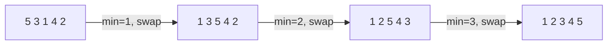
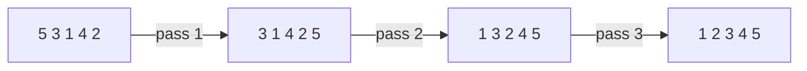
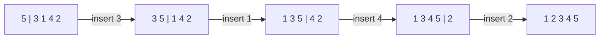
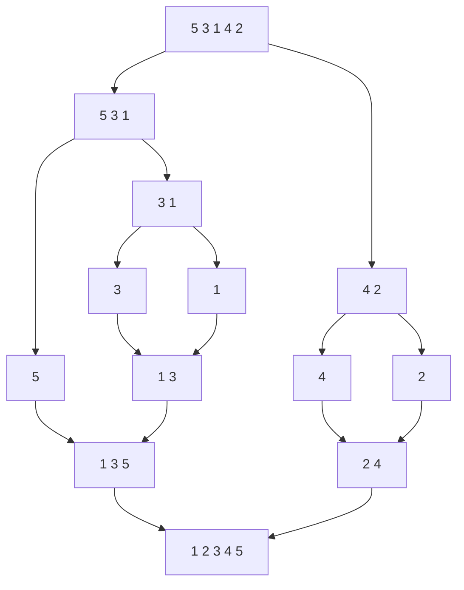
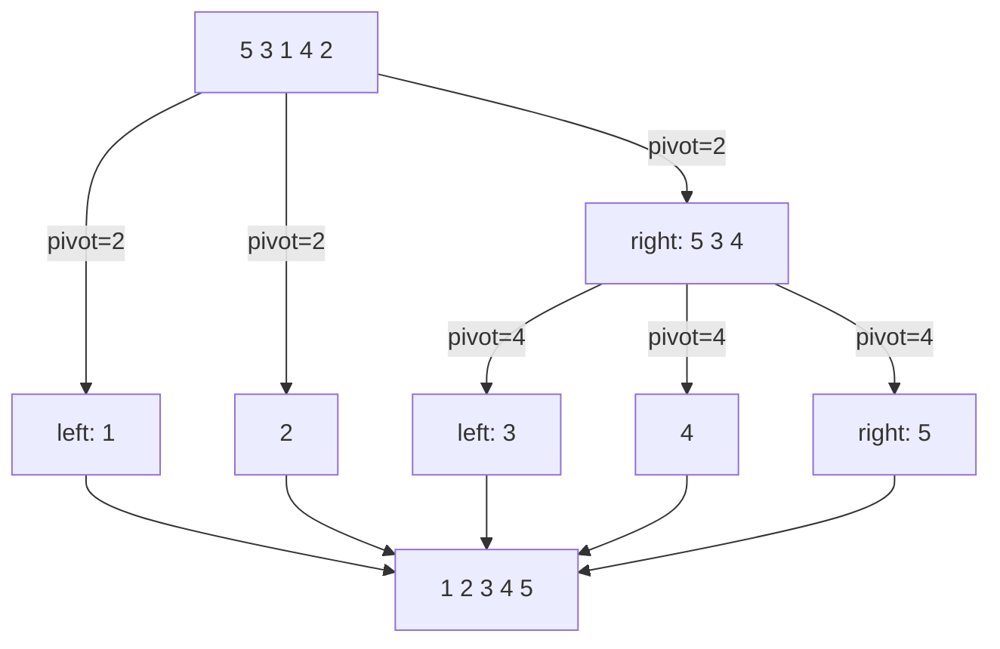
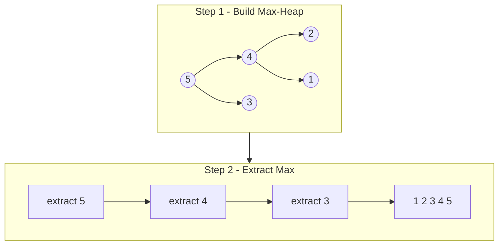

# Sorting Algorithms

| Algorithm      | Best       | Average    | Worst      | Space    | Stable |
|----------------|------------|------------|------------|----------|--------|
| Selection Sort | O(n²)      | O(n²)      | O(n²)      | O(1)     | No     |
| Bubble Sort    | O(n)       | O(n²)      | O(n²)      | O(1)     | Yes    |
| Insertion Sort | O(n)       | O(n²)      | O(n²)      | O(1)     | Yes    |
| Merge Sort     | O(n log n) | O(n log n) | O(n log n) | O(n)     | Yes    |
| Quick Sort     | O(n log n) | O(n log n) | O(n²)      | O(log n) | No     |
| Heap Sort      | O(n log n) | O(n log n) | O(n log n) | O(1)     | No     |

## Selection Sort

Repeatedly finds the minimum element from the unsorted portion and swaps it to the front.



```c++
void selectionSort(int arr[], int n) {
    for (int i = 0; i < n - 1; i++) {
        int min_idx = i;
        for (int j = i + 1; j < n; j++)
            if (arr[j] < arr[min_idx])
                min_idx = j;
        swap(&arr[min_idx], &arr[i]);
    }
}
```

## Bubble Sort

Repeatedly swaps adjacent elements that are in the wrong order, bubbling the largest to the end each pass.



```c++
void bubbleSort(int arr[], int n) {
    for (int i = 0; i < n - 1; i++)
        for (int j = 0; j < n - i - 1; j++)
            if (arr[j] > arr[j + 1])
                swap(&arr[j], &arr[j + 1]);
}
```

## Insertion Sort

Builds a sorted prefix one element at a time by inserting each new element into its correct position.



```c++
void insertionSort(int arr[], int n) {
    for (int i = 1; i < n; i++) {
        int key = arr[i];
        int j = i - 1;
        while (j >= 0 && arr[j] > key) {
            arr[j + 1] = arr[j];
            j--;
        }
        arr[j + 1] = key;
    }
}
```

## Merge Sort

Divide and conquer — recursively splits the array in half, sorts each half, then merges them.



- Time complexity: T(n) = 2T(n/2) + O(n) → O(n log n) in all cases
- Space complexity: O(n)
- [Merge Sort for Linked List](https://docs.google.com/document/d/1AYbPXgcxxtZ5BUlXsdTIMrCs8uluWQ9NoVdXiWy7DPw/edit)

## Quick Sort

Picks a pivot, partitions elements into less-than and greater-than groups, then recurses on each side.



- Time complexity: T(n) = T(k) + T(n-k) + O(n)
- Best/avg: O(n log n) — Worst: O(n²) when pivot is always min/max

## Heap Sort

Builds a max-heap from the array, then repeatedly extracts the maximum to produce a sorted result.



- Heapify: O(n)
- Insert / delete: O(log n)
- Overall: O(n log n) in all cases, O(1) space
- [Video reference](https://www.youtube.com/watch?v=HqPJF2L5h9U)
