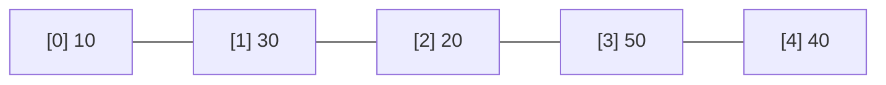
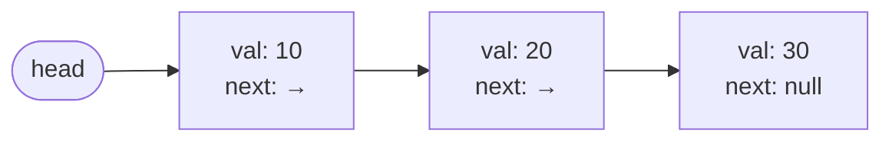
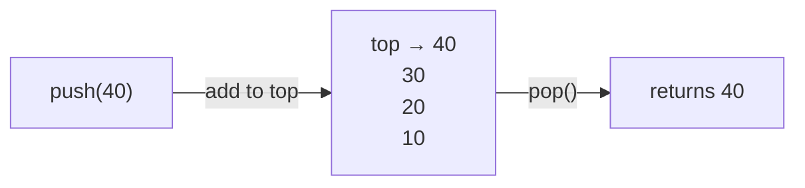
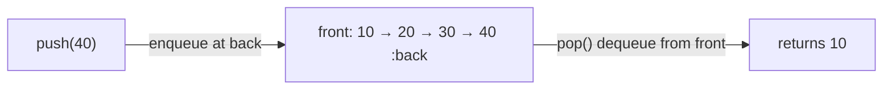

# Data Structures

| Structure      | Access   | Search   | Insert   | Delete   | Space |
|----------------|----------|----------|----------|----------|-------|
| Array          | O(1)     | O(n)     | O(n)     | O(n)     | O(n)  |
| Linked List    | O(n)     | O(n)     | O(1)     | O(1)     | O(n)  |
| Stack          | O(n)     | O(n)     | O(1)     | O(1)     | O(n)  |
| Queue          | O(n)     | O(n)     | O(1)     | O(1)     | O(n)  |
| Hash Map       | O(1) avg | O(1) avg | O(1) avg | O(1) avg | O(n)  |
| Map / Set      | O(log n) | O(log n) | O(log n) | O(log n) | O(n)  |

---

## Arrays

Contiguous block of memory. Random access in O(1) via index.



```cpp
vector<int> v(10, 0);   // size 10, all zeros
v.push_back(1);
v.pop_back();
v[i];
sort(v.begin(), v.end());
```

**Pointers (C++):**

```cpp
int var = 10;
int *ptr = &var;  // ptr holds address of var
// var=10, ptr=<address>, *ptr=10
```

---

## Linked List

Chain of nodes where each node holds a value and a pointer to the next node.



```cpp
class Node {
    int val;
    Node *next;
    Node(int x) : val(x), next(nullptr) {}
};
```

- **STL:** `list<T>` — `front()`, `back()`, `push_back()`, `push_front()`
- **Doubly linked list:** each node has `prev` and `next` pointers
- **Floyd's Cycle Detection:** use slow/fast pointers to detect a cycle in O(n) time, O(1) space — [reference](https://www.geeksforgeeks.org/floyds-cycle-finding-algorithm/)

---

## Strings

```cpp
s.find(delim, start);        // returns start index of delim, or string::npos if not found
s.substr(pos, len);          // returns substring of length len starting at pos
```

---

## Stack

LIFO — last in, first out. Used for recursion, undo operations, expression parsing.



**STL:** `stack<T>` — `push()`, `pop()`, `top()`, `size()`, `empty()`

**Key problems:**
- Implement queue using two stacks — enqueue or dequeue costs O(n)
- Implement stack using two queues — push or pop costs O(n)
- Infix to postfix conversion
- Stock span problem
- Balanced parentheses
- Next greater element

---

## Queues

FIFO — first in, first out. Used for BFS, scheduling, buffers.



**STL:** `queue<T>` — `push()`, `pop()`, `front()`, `back()`, `size()`, `empty()`

**Deque:** `deque<T>` — supports `push_back()`, `pop_back()`, `push_front()`, `pop_front()`

---

## Hashing

Provides average O(1) insert, lookup, and delete using a hash function.

```cpp
unordered_set<int> s;
unordered_map<int, int> m;

s.insert(x);  m.insert({k, v});
s.find(x);    m.find(k);         // returns iterator, check != end()
s.erase(x);   m.erase(k);
```

---

## Maps / Sets

Backed by a red-black tree (self-balancing BST). All operations O(log n). Keys are always sorted.

```cpp
map<int, int> m;
set<int> s;

m.insert({k, v});
s.insert(x);
m.find(k);    // O(log n)
m.erase(k);

multiset<int> ms;   // allows duplicate values
```

