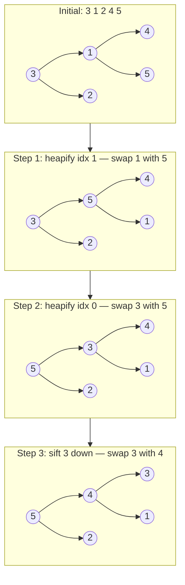

# Heap

Complete binary tree. Max-heap: parent ≥ children. Min-heap: parent ≤ children.

| Operation | Time     |
|-----------|----------|
| Peek      | O(1)     |
| Insert    | O(log n) |
| Delete    | O(log n) |
| Heapify   | O(n)     |
| Search    | O(n)     |

**How it works:**
Start from the last non-leaf node (index `n/2 - 1`) and run **sift-down** towards the root. Sift-down compares a node with its children and swaps it with the largest child, repeating until the node is in the correct position. Processing bottom-up ensures every subtree is a valid heap before its parent is processed, achieving O(n) build time rather than O(n log n).

Build max-heap from `[3, 1, 2, 4, 5]` — start heapifying from the last non-leaf (index 1) up to root (index 0):



**STL:**

```cpp
priority_queue<int> maxH;                                // max-heap (default)
priority_queue<int, vector<int>, greater<int>> minH;     // min-heap

maxH.push(x);  maxH.pop();  maxH.top();
```

**Custom comparator:**

```cpp
auto cmp = [](int a, int b) { return a > b; };  // min-heap
priority_queue<int, vector<int>, decltype(cmp)> pq(cmp);
```

- Supports duplicates
- Built on a complete binary tree stored as an array — node `i` has children at `2i+1` and `2i+2`
