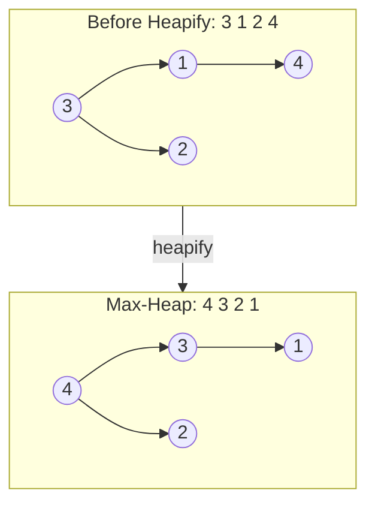

# Heap

Complete binary tree. Max-heap: parent ≥ children. Min-heap: parent ≤ children.

| Operation | Time     |
|-----------|----------|
| Peek      | O(1)     |
| Insert    | O(log n) |
| Delete    | O(log n) |
| Heapify   | O(n)     |
| Search    | O(n)     |



**STL:**

```cpp
priority_queue<int> maxH;                                // max-heap (default)
priority_queue<int, vector<int>, greater<int>> minH;     // min-heap

maxH.push(x);  maxH.pop();  maxH.top();
```

**Custom comparator:**

```cpp
auto cmp = [](int a, int b) { return a > b; };  // min-heap
priority_queue<int, vector<int>, decltype(cmp)> pq(cmp);
```

- Supports duplicates
- Built on a complete binary tree stored as an array — node `i` has children at `2i+1` and `2i+2`
