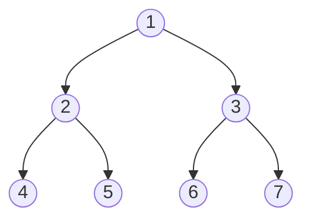
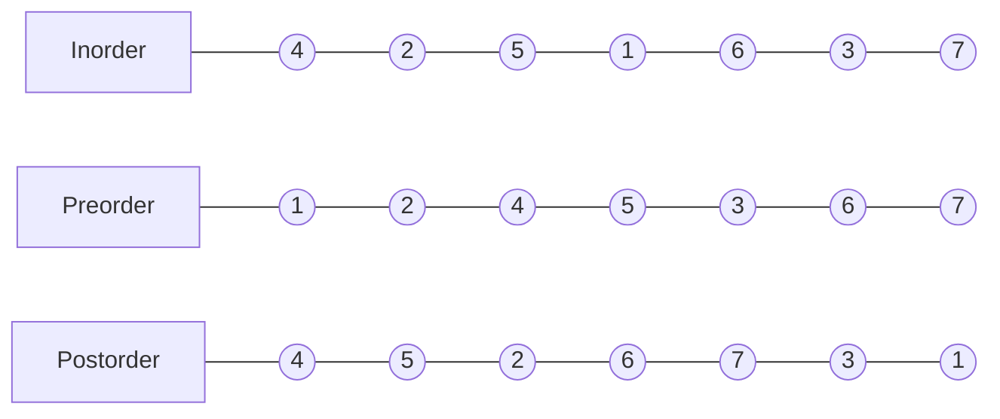
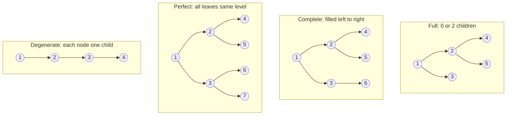

# Tree

A non-linear hierarchical data structure where each node has at most two children (binary tree).

| Property               | Value                  |
|------------------------|------------------------|
| Min height             | log(n+1)               |
| Max nodes at level l   | 2^l                    |
| Max nodes (height h)   | 2^h - 1                |
| Edges                  | n - 1                  |

---

## Structure

---

## Traversals

### DFS — O(n) time, O(h) space

| Order     | Pattern                  | Result on tree above |
|-----------|--------------------------|----------------------|
| Inorder   | Left → Root → Right      | 4 2 5 1 6 3 7        |
| Preorder  | Root → Left → Right      | 1 2 4 5 3 6 7        |
| Postorder | Left → Right → Root      | 4 5 2 6 7 3 1        |

**Morris Inorder** — O(n) time, O(1) space: threads the tree using null right pointers to avoid a stack.

### BFS / Level Order — O(n) time, O(n) space

Uses a queue. Visits nodes level by level: `1 → 2 3 → 4 5 6 7`

---

## Tree Types

- **Balanced** — height = O(log n), e.g. AVL, Red-Black Tree
- **Degenerate** — degrades to a linked list, O(n) operations

---

## Properties

- In a full binary tree, leaf nodes = internal nodes + 1
- Nth Catalan number gives count of structurally unique BSTs with n nodes:
  `T(n) = Σ T(i) * T(n-i-1)` for i = 0..n-1

---

## Key Operations

- **Insert** — BFS until a node with an empty child slot is found, insert there
- **Delete** — replace with inorder successor or deepest rightmost node
- **Inorder without recursion** — use an explicit stack
- **Inorder without recursion or stack** — Morris traversal
- **Reconstruct tree** — from inorder + preorder, or inorder + postorder
