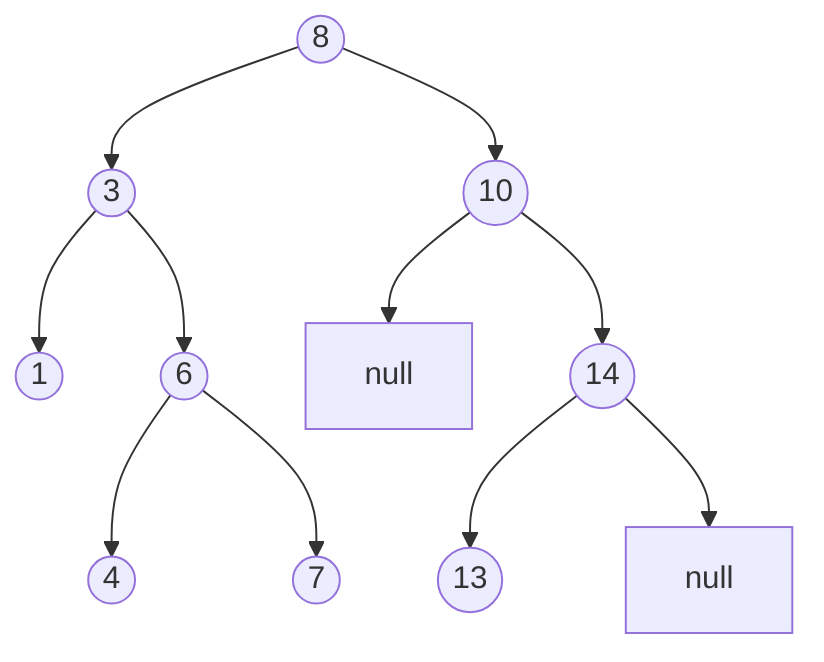
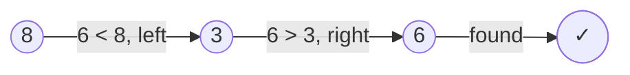
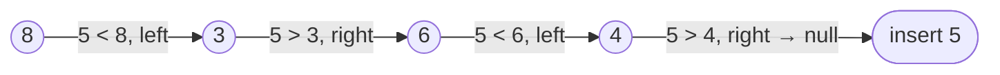
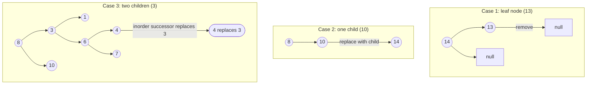

# Binary Search Tree

A binary tree where for every node: all left subtree values < node < all right subtree values. No duplicates.

| Operation | Average  | Worst (skewed) |
|-----------|----------|----------------|
| Search    | O(log n) | O(n)           |
| Insert    | O(log n) | O(n)           |
| Delete    | O(log n) | O(n)           |

---

## Structure

---

## Search

Compare target to current node — go left if smaller, right if larger.

---

## Insert

Follow search path until a null slot is found, insert there.

---

## Delete

Three cases depending on the node's children:

- **Case 1** — node is a leaf: simply remove it
- **Case 2** — node has one child: replace node with its child
- **Case 3** — node has two children: replace with **inorder successor** (smallest node in right subtree), then delete the successor

---

## BST vs Hash Table

| | BST | Hash Table |
|---|---|---|
| Search | O(log n) | O(1) avg |
| Range queries | O(log n + k) | O(n) |
| Sorted order | Yes (inorder) | No |
| Worst case | O(n) | O(n) |

BST is preferred for **range queries** and when **sorted order** is needed.

---

## Key Operations

- **Construct BST from preorder traversal** — use a stack or recursion with range checks
- **Sorted array → BST** — pick mid as root, recurse on left and right halves → O(n)
- **Sorted linked list → BST** — find mid via slow/fast pointers → O(n log n)
- **Lowest Common Ancestor** — if both nodes < root go left, both > root go right, else root is LCA
- **Convert to greater sum tree** — reverse inorder traversal (right → root → left), accumulate sum
