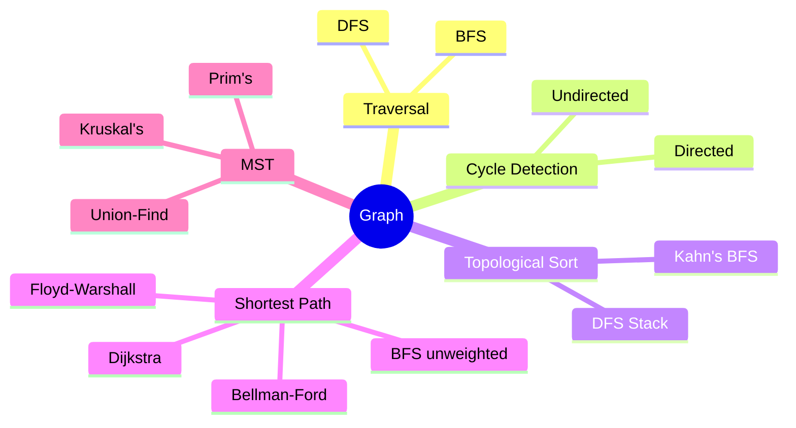
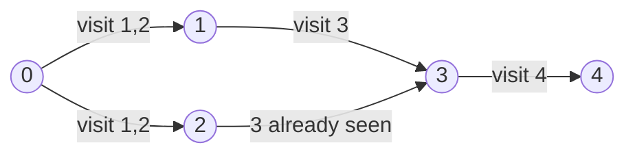
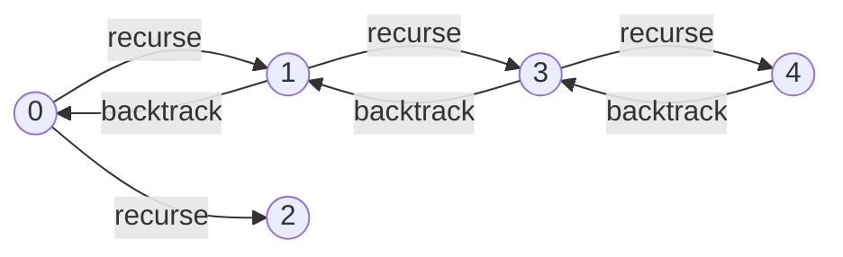

# Graph



A set of vertices connected by edges. Can be directed/undirected and weighted/unweighted.

| Algorithm      | Time           | Space | Notes                            |
|----------------|----------------|-------|----------------------------------|
| BFS            | O(V+E)         | O(V)  | Shortest path (unweighted)       |
| DFS            | O(V+E)         | O(V)  | Cycle detection, topo sort       |
| Dijkstra       | O((V+E) log V) | O(V)  | No negative edges                |
| Bellman-Ford   | O(VE)          | O(V)  | Handles negative edges           |
| Floyd-Warshall | O(V³)          | O(V²) | All-pairs shortest path          |
| Prim's         | O(E log V)     | O(V)  | MST, good for dense graphs       |
| Kruskal's      | O(E log E)     | O(V)  | MST, good for sparse graphs      |

---

## Representations

**Adjacency List** — O(V+E) space, preferred for sparse graphs

```
0 → [1, 2]
1 → [3]
2 → [3]
3 → [4]
```

**Adjacency Matrix** — O(V²) space, O(1) edge lookup, preferred for dense graphs

```
  0 1 2 3 4
0[0,1,1,0,0]
1[0,0,0,1,0]
2[0,0,0,1,0]
3[0,0,0,0,1]
4[0,0,0,0,0]
```

---

## BFS

Explores level by level using a queue. Finds shortest path in unweighted graphs.



**Order:** 0 → 1 → 2 → 3 → 4

**Algorithm:**
1. Enqueue source, mark visited
2. Dequeue node, process all unvisited neighbours — enqueue and mark each
3. Repeat until queue is empty

- For disconnected graphs: run BFS from each unvisited vertex
- Maintain `dist[]` and `parent[]` to reconstruct shortest path
- Time: O(V+E) — Space: O(V)

---

## DFS

Explores as deep as possible before backtracking. Uses recursion or an explicit stack.



**Order:** 0 → 1 → 3 → 4 → 2

**Algorithm:**
1. Mark current node visited
2. Recurse on each unvisited neighbour
3. For disconnected graphs: call DFS from each unvisited vertex

- Time: O(V+E) — Space: O(V)
- Applications: cycle detection, topological sort, path finding, SCCs
