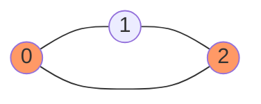
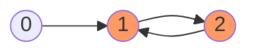

# Cycle Detection

A cycle exists when a path leads back to an already-visited node. Detection differs between undirected and directed graphs.

---

## Undirected Graph

In an undirected graph, a cycle is present if DFS or BFS reaches a visited node that is **not** the direct parent.

### DFS — track parent

For each node, pass its parent into the recursive call. If a visited neighbour is not the parent, a back edge is found → cycle.



```
dfs(node, parent, visited):
    visited[node] = true
    for each neighbour in adj[node]:
        if not visited[neighbour]:
            if dfs(neighbour, node, visited):
                return true          // cycle found deeper
        else if neighbour != parent:
            return true              // back edge → cycle
    return false
```

### BFS — track parent

Same idea with a queue. Store `(node, parent)` pairs.

```
for each unvisited node:
    enqueue (node, -1)
    while queue not empty:
        (curr, parent) = dequeue
        for each neighbour:
            if not visited:
                enqueue (neighbour, curr)
            else if neighbour != parent:
                return true   // cycle found
```

**Time:** O(V+E) — **Space:** O(V)

---

## Directed Graph

In a directed graph, a node is part of a cycle only if it is reached again **while still in the current DFS call stack** (i.e., the current active path).

A visited node that is no longer on the stack is not a cycle — it was visited via a different path.



### DFS — visited + recursion stack

Maintain two arrays: `visited[]` and `recStack[]`.

```
dfs(node):
    visited[node] = true
    recStack[node] = true

    for each neighbour in adj[node]:
        if not visited[neighbour]:
            if dfs(neighbour): return true
        else if recStack[neighbour]:
            return true       // back edge in current path → cycle

    recStack[node] = false    // remove from path on backtrack
    return false
```

### BFS — Kahn's Algorithm

Run topological sort (Kahn's). If the number of nodes processed is less than V, a cycle is present (some nodes were never enqueued because their in-degree never reached 0).

```
compute in-degree for all nodes
enqueue all nodes with in-degree 0
count = 0
while queue not empty:
    node = dequeue
    count++
    for each neighbour: reduce in-degree by 1
        if in-degree == 0: enqueue

if count < V: cycle exists
```

**Time:** O(V+E) — **Space:** O(V)

---

## Summary

| Graph Type  | Method           | Key Idea                              |
|-------------|------------------|---------------------------------------|
| Undirected  | DFS with parent  | visited neighbour ≠ parent → cycle    |
| Undirected  | BFS with parent  | same idea with a queue                |
| Directed    | DFS + recStack   | visited neighbour in active path      |
| Directed    | Kahn's BFS       | processed count < V → cycle           |
