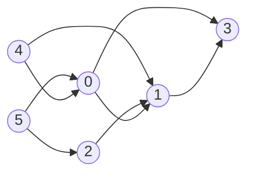
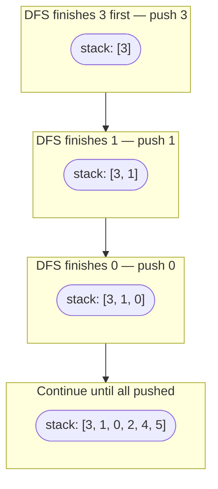
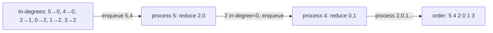

# Topological Sort

A linear ordering of vertices in a **Directed Acyclic Graph (DAG)** such that for every edge u→v, u appears before v. Not possible if the graph has a cycle.



**One valid order:** 5 → 4 → 2 → 0 → 1 → 3

**Use cases:** build systems, task scheduling, course prerequisites, dependency resolution.

---

## DFS + Stack

The key insight: a node should appear in the output only after all nodes reachable from it are processed. DFS naturally finishes the deepest nodes first — push to a stack on return, then pop the stack for the final order.



**Algorithm:**

```
topo_sort():
    visited = {}
    stack = []

    dfs(node):
        visited[node] = true
        for each neighbour in adj[node]:
            if not visited[neighbour]:
                dfs(neighbour)
        stack.push(node)          // push after all descendants processed

    for each unvisited node:
        dfs(node)

    return stack reversed         // or pop stack for order
```

**Time:** O(V+E) — **Space:** O(V)

---

## BFS — Kahn's Algorithm

Works by repeatedly removing nodes with no incoming edges (in-degree 0). This simulates "what can be done first when nothing depends on it."



**Algorithm:**

```
compute in-degree for every node
enqueue all nodes with in-degree 0
result = []

while queue not empty:
    node = dequeue
    result.append(node)
    for each neighbour of node:
        in-degree[neighbour] -= 1
        if in-degree[neighbour] == 0:
            enqueue(neighbour)

if len(result) < V: cycle detected (not a DAG)
return result
```

**Time:** O(V+E) — **Space:** O(V)

---

## DFS vs Kahn's

| | DFS + Stack | Kahn's BFS |
|---|---|---|
| Approach | post-order push | in-degree peeling |
| Cycle detection | needs separate recStack | built-in (count < V) |
| Output order | reverse finish time | front-to-back naturally |
| Preferred when | recursive DFS is natural | cycle detection needed too |
