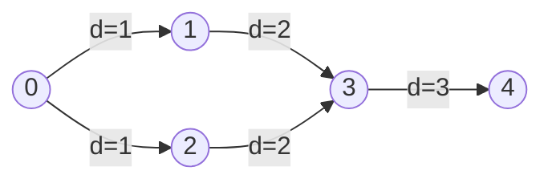
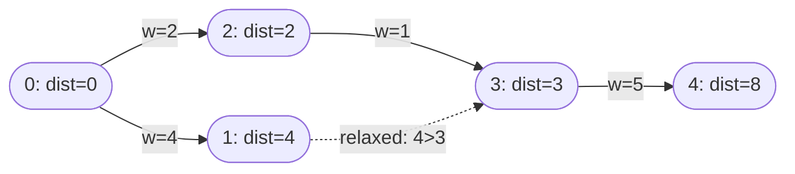
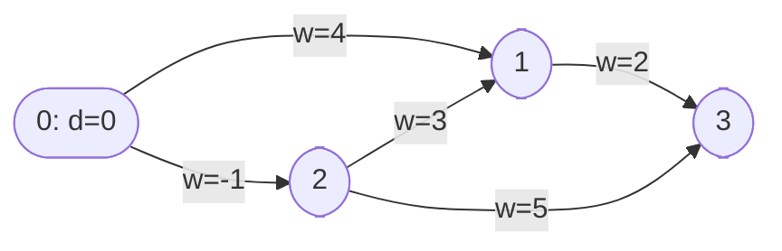
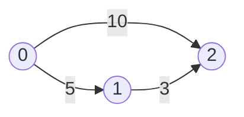
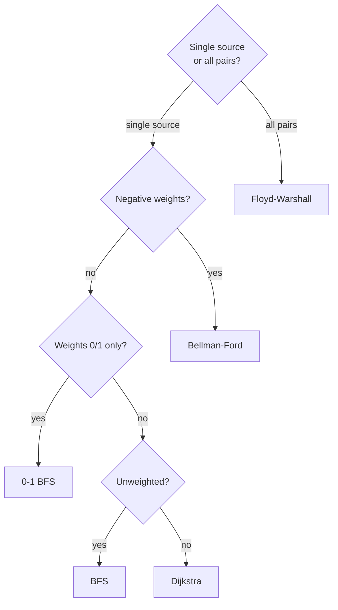

# Shortest Path

| Algorithm      | Graph Type          | Edge Weights     | Time           |
|----------------|---------------------|------------------|----------------|
| BFS            | Unweighted          | All equal        | O(V+E)         |
| 0-1 BFS        | Directed            | 0 or 1 only      | O(V+E)         |
| Dijkstra       | Directed/Undirected | Non-negative     | O((V+E) log V) |
| Bellman-Ford   | Directed            | Any (no neg cycle)| O(VE)         |
| Floyd-Warshall | Any                 | Any              | O(V³)          |

---

## BFS — Unweighted Graph

BFS naturally finds shortest paths in unweighted graphs because it explores nodes in order of increasing distance.



Maintain `dist[]` initialised to ∞. Set `dist[src]=0`. When visiting a neighbour, set `dist[neighbour] = dist[curr] + 1` if not visited.

Maintain `parent[]` to reconstruct the path by tracing back from destination to source.

---

## 0-1 BFS

For graphs where edge weights are only 0 or 1. Uses a **deque** instead of a regular queue.

- Weight 0 edge: push to **front** (no cost, treat as same level)
- Weight 1 edge: push to **back** (costs one step, next level)

This is more efficient than Dijkstra for this special case — O(V+E) vs O((V+E) log V).

Useful for **grid-based problems** where moving in some directions is free and others cost 1.

---

## Dijkstra

Greedily picks the unvisited node with the smallest known distance and relaxes its neighbours. Relies on the fact that once a node is popped from the min-heap, its shortest distance is finalised (only works with non-negative weights).



**Algorithm:**

```
dist[src] = 0, dist[all others] = ∞
min-heap: push (0, src)

while heap not empty:
    (d, u) = pop min
    if d > dist[u]: continue      // stale entry, skip
    for each (v, w) in adj[u]:
        if dist[u] + w < dist[v]:
            dist[v] = dist[u] + w
            push (dist[v], v) to heap
```

**Why relaxation works:** once a node is popped, no shorter path can arrive later (all weights ≥ 0), so its distance is final.

**Time:** O((V+E) log V) with a min-heap

---

## Bellman-Ford

Relaxes **all** edges V−1 times. After k iterations, all shortest paths using at most k edges are found. V−1 is enough because the longest simple path in a V-node graph has V−1 edges.



**Algorithm:**

```
dist[src] = 0, dist[all others] = ∞

repeat V-1 times:
    for each edge (u, v, w):
        if dist[u] + w < dist[v]:
            dist[v] = dist[u] + w

// Negative cycle check:
for each edge (u, v, w):
    if dist[u] + w < dist[v]:
        "negative cycle exists"
```

**Why V−1 iterations?** Each iteration guarantees shortest paths of one more edge length. If a path can still be relaxed on the Vth pass, it means a negative cycle is shortening it indefinitely.

**Time:** O(VE) — **Space:** O(V)

---

## Floyd-Warshall

Finds shortest paths between **all pairs** of vertices. Uses dynamic programming: for each intermediate vertex k, check if routing i→k→j is shorter than the current i→j.



After Floyd-Warshall: dist[0][2] = 8 (via 0→1→2) not 10 (direct).

**Algorithm:**

```
initialise dist[i][j] from edge weights (∞ if no edge, 0 if i==j)

for k in 0..V:
    for i in 0..V:
        for j in 0..V:
            dist[i][j] = min(dist[i][j], dist[i][k] + dist[k][j])
```

**Key insight:** after the loop for k, `dist[i][j]` holds the shortest path using only vertices 0..k as intermediates.

**Time:** O(V³) — **Space:** O(V²)

---

## When to Use Which


