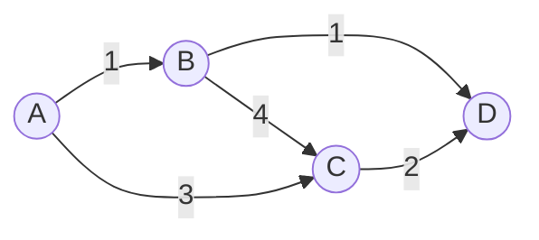
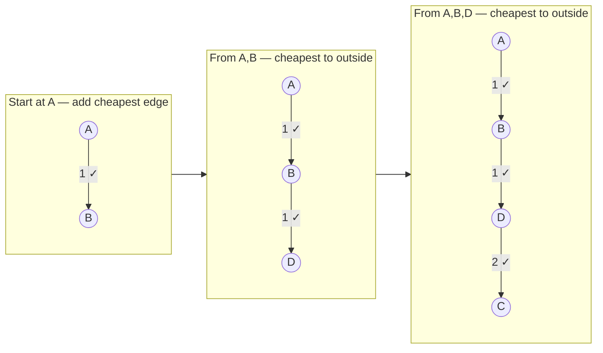
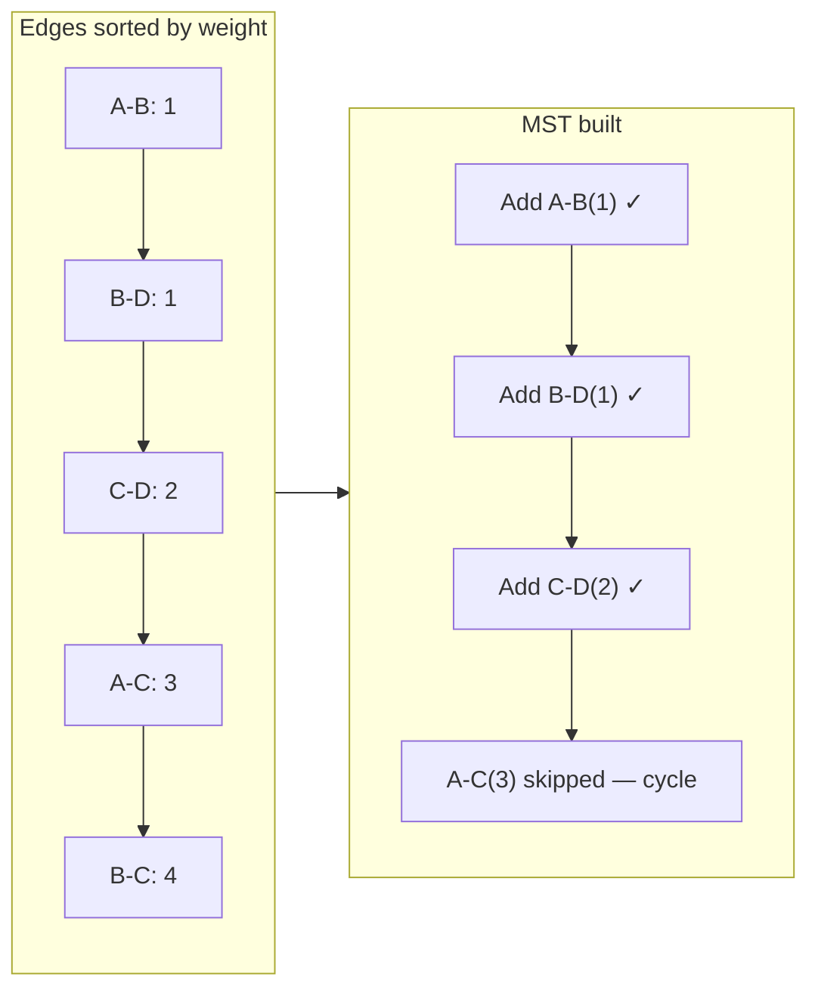
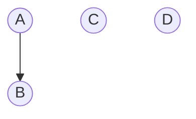
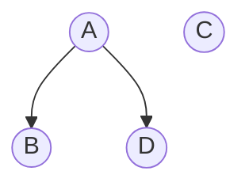
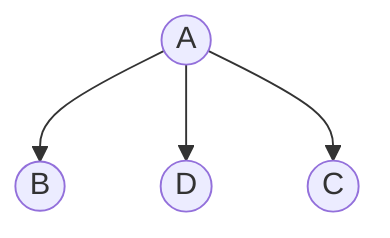
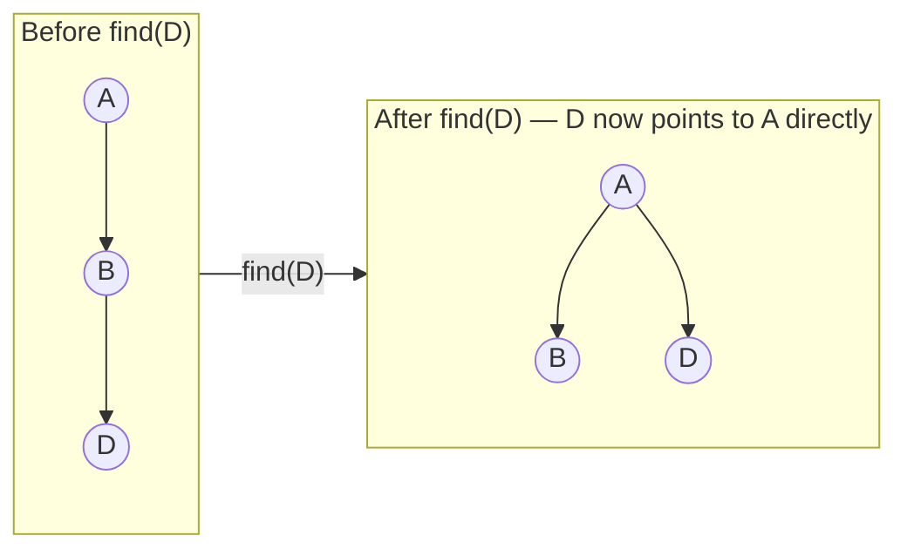
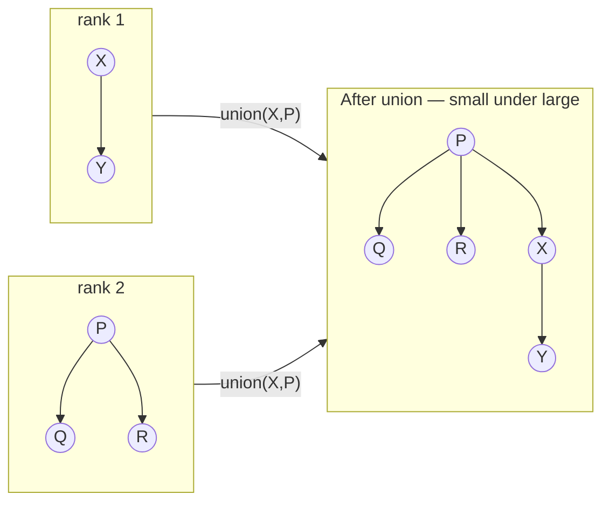

# Minimum Spanning Tree

A **spanning tree** connects all V vertices of a graph using exactly V−1 edges with no cycles. An **MST** is the spanning tree with the minimum total edge weight.

- Only defined for connected, weighted, undirected graphs
- May not be unique if edge weights are equal
- V vertices → exactly V−1 edges in the MST



**MST edges:** A-B(1), B-D(1), C-D(2) → total weight: **4**

---

## Prim's Algorithm

Grows the MST one vertex at a time. Always picks the cheapest edge that connects the current MST to an unvisited vertex.

**Think of it as:** expanding a bubble — at each step, pick the cheapest way to add one more node to the bubble.



**Algorithm:**

```
visited = {src}
min-heap: push all edges from src with their weights

while heap not empty and MST has < V-1 edges:
    (w, u, v) = pop min
    if v already visited: skip
    add edge (u,v,w) to MST
    visited.add(v)
    push all edges from v to unvisited nodes into heap
```

**Time:** O(E log V) with a min-heap — **Space:** O(V+E)

---

## Kruskal's Algorithm

Builds the MST by sorting all edges and adding them greedily, skipping any edge that would form a cycle. Uses **Union-Find** to detect cycles efficiently.

**Think of it as:** picking globally cheapest edges one by one, connecting separate components.



**Algorithm:**

```
sort all edges by weight
MST = []

for each edge (u, v, w) in sorted order:
    if find(u) != find(v):     // different components, no cycle
        MST.add(edge)
        union(u, v)
    if len(MST) == V-1: break
```

**Time:** O(E log E) for sorting — **Space:** O(V)

---

## Union-Find (Disjoint Set Union)

Data structure used by Kruskal's to track which vertices are in the same component and detect cycles in near-constant time.

Two operations:
- **find(x)** — returns the root (representative) of x's component
- **union(x, y)** — merges the components of x and y

### Step-by-step trace — Kruskal's on the example graph

Edges processed in order: A-B(1), B-D(1), C-D(2), A-C(3)

**Initial — each node is its own component:**


`parent: A→A  B→B  C→C  D→D`

---

**union(A, B)** — find(A)=A, find(B)=B → different → merge, A becomes root:


`parent: A→A  B→A  C→C  D→D`

---

**union(B, D)** — find(B)→A, find(D)=D → different → D joins A's tree:


`parent: A→A  B→A  C→C  D→A`

---

**union(C, D)** — find(C)=C, find(D)→A → different → C joins A's tree:


`parent: A→A  B→A  C→A  D→A`

---

**check A-C(3)** — find(A)=A, find(C)→A → **same root → cycle! skip.**

| Edge | find(u) | find(v) | Same? | Action |
|------|---------|---------|-------|--------|
| A-B(1) | A | B | no | union → add to MST |
| B-D(1) | A | D | no | union → add to MST |
| C-D(2) | C | A | no | union → add to MST |
| A-C(3) | A | A | **yes** | **skip — cycle** |

---

### Path Compression

Without compression, `find` walks up the chain on every call. Path compression makes every node on the path point directly to the root — flattening the tree permanently.



```
find(x):
    if parent[x] != x:
        parent[x] = find(parent[x])   // path compression
    return parent[x]
```

### Union by Rank

Attaches the shorter tree under the taller one. Without this, repeated unions could produce a linked list (O(n) find).



```
union(x, y):
    px, py = find(x), find(y)
    if px == py: return            // already in same set
    if rank[px] < rank[py]: swap(px, py)
    parent[py] = px
    if rank[px] == rank[py]: rank[px]++
```

### Implementation

```cpp
struct UnionFind {
    vector<int> parent, rank;

    UnionFind(int n) : parent(n), rank(n, 0) {
        iota(parent.begin(), parent.end(), 0);  // parent[i] = i
    }

    int find(int x) {
        if (parent[x] != x)
            parent[x] = find(parent[x]);  // path compression
        return parent[x];
    }

    bool unite(int x, int y) {
        int px = find(x), py = find(y);
        if (px == py) return false;        // same component → cycle
        if (rank[px] < rank[py]) swap(px, py);
        parent[py] = px;
        if (rank[px] == rank[py]) rank[px]++;
        return true;
    }
};
```

**Time:** O(α(n)) ≈ O(1) per operation — α is the inverse Ackermann function, effectively constant for all practical inputs.

---

## Prim's vs Kruskal's

| | Prim's | Kruskal's |
|---|---|---|
| Approach | Grow from a vertex | Sort edges globally |
| Best for | Dense graphs (many edges) | Sparse graphs (few edges) |
| Data structure | Min-heap | Union-Find + sorted edges |
| Time | O(E log V) | O(E log E) |
| Handles disconnected? | No (needs connected graph) | Yes (finds MST per component) |
