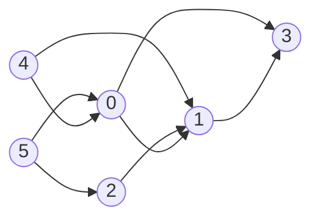
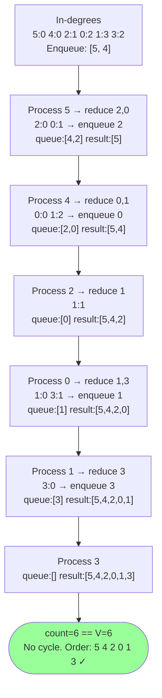
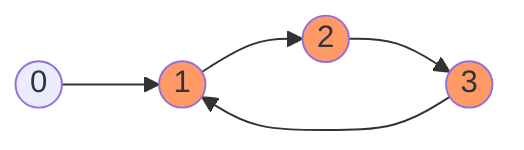
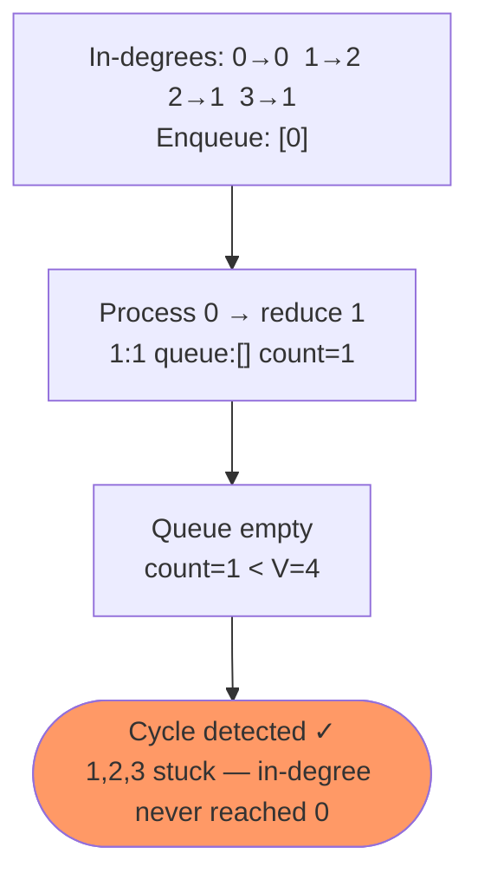

# Kahn's Algorithm

A BFS-based algorithm that processes a graph by repeatedly removing nodes with no incoming edges (in-degree 0). Serves two purposes:

1. **Topological Sort** — produces a valid linear ordering of a DAG
2. **Cycle Detection** — if not all nodes are processed, a cycle exists

**Time:** O(V+E) — **Space:** O(V)

---

## Core Idea — In-Degree

**In-degree** of a node = number of edges pointing *into* it.

A node with in-degree 0 has no dependencies — it is safe to process immediately. After processing it, reduce the in-degree of its neighbours. If any neighbour hits 0, it becomes ready to process next.



**In-degrees:** `5→0, 4→0, 2→1, 0→2, 1→3, 3→2`

---

## Step-by-Step Trace



---

## Cycle Detection

If a cycle exists, nodes in the cycle always have in-degree ≥ 1 — they point at each other and never get enqueued. The processed count ends up less than V.





---

## Implementation

```cpp
vector<int> kahnSort(int V, vector<vector<int>>& adj) {
    vector<int> inDegree(V, 0);
    for (int u = 0; u < V; u++)
        for (int v : adj[u])
            inDegree[v]++;

    queue<int> q;
    for (int i = 0; i < V; i++)
        if (inDegree[i] == 0) q.push(i);

    vector<int> result;
    while (!q.empty()) {
        int node = q.front(); q.pop();
        result.push_back(node);
        for (int neighbour : adj[node])
            if (--inDegree[neighbour] == 0)
                q.push(neighbour);
    }

    if (result.size() < V) return {};   // cycle detected
    return result;
}
```

---

## Summary

| Use Case | What to check |
|---|---|
| Topological sort | Return `result` — valid order if `size == V` |
| Cycle detection | `result.size() < V` → cycle exists |
| Both at once | Run once, check size, use result |
