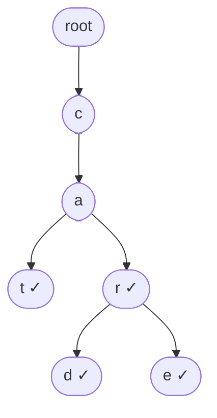
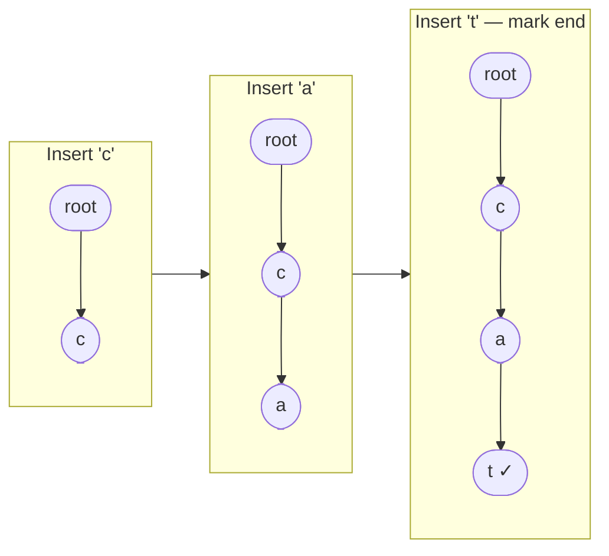
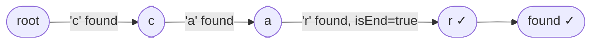

# Trie

A tree-like data structure optimised for string storage, prefix search, and autocomplete. Each path from root to a marked node spells a word.

| Operation   | Time       | Space                        |
|-------------|------------|------------------------------|
| Insert      | O(m)       | O(ALPHABET_SIZE × m × n)     |
| Search      | O(m)       | —                            |
| Prefix check| O(m)       | —                            |

> m = word length, n = number of words

---

## Structure

Each node represents one character and holds:
- An array/map of child nodes (one per possible next character)
- `isEndOfWord` flag — marks whether a complete word ends at this node



Words stored: **cat, car, card, care**. Shared prefix `ca` uses the same nodes.

```cpp
class Node {
    Node* children[26] = {};
    bool isEndOfWord = false;
};
```

**With prefix/count tracking (advanced):**

```cpp
class Node {
    Node* children[26] = {};
    int countEndWith = 0;    // how many words end at this node
    int countPrefix = 0;     // how many words pass through this node
};
```

---

## Insertion

Walk character by character from the root. Create a new node if the child doesn't exist. Mark `isEndOfWord = true` at the last character.



```cpp
void insert(Node* root, string word) {
    Node* curr = root;
    for (char c : word) {
        int i = c - 'a';
        if (!curr->children[i])
            curr->children[i] = new Node();
        curr = curr->children[i];
    }
    curr->isEndOfWord = true;
}
```

**Time:** O(m) — **Space:** O(m) per new word (fewer if prefix already exists)

---

## Search

Walk character by character. Return true only if all characters are found **and** the last node has `isEndOfWord = true`.



```cpp
bool search(Node* root, string word) {
    Node* curr = root;
    for (char c : word) {
        int i = c - 'a';
        if (!curr->children[i]) return false;
        curr = curr->children[i];
    }
    return curr->isEndOfWord;
}
```

**Prefix check** — same as search but remove the `isEndOfWord` check at the end.

```cpp
bool startsWith(Node* root, string prefix) {
    Node* curr = root;
    for (char c : prefix) {
        int i = c - 'a';
        if (!curr->children[i]) return false;
        curr = curr->children[i];
    }
    return true;
}
```

---

## Use Cases

- **Autocomplete** — find all words with a given prefix
- **Spell checker** — check if a word exists in the dictionary
- **IP routing** — longest prefix matching
- **Word games** — fast dictionary lookup

---

## Trie vs Hash Map

| | Trie | Hash Map |
|---|---|---|
| Prefix search | O(m) | O(n) — scan all keys |
| Exact search | O(m) | O(1) avg |
| Space | Higher (node overhead) | Lower |
| Sorted order | Yes (DFS gives lexicographic) | No |

Reference: [Striver Trie Playlist](https://www.youtube.com/watch?v=RV0QeTyHZxo&list=PLgUwDviBIf0pcIDCZnxhv0LkHf5KzG9zp&index=4)
