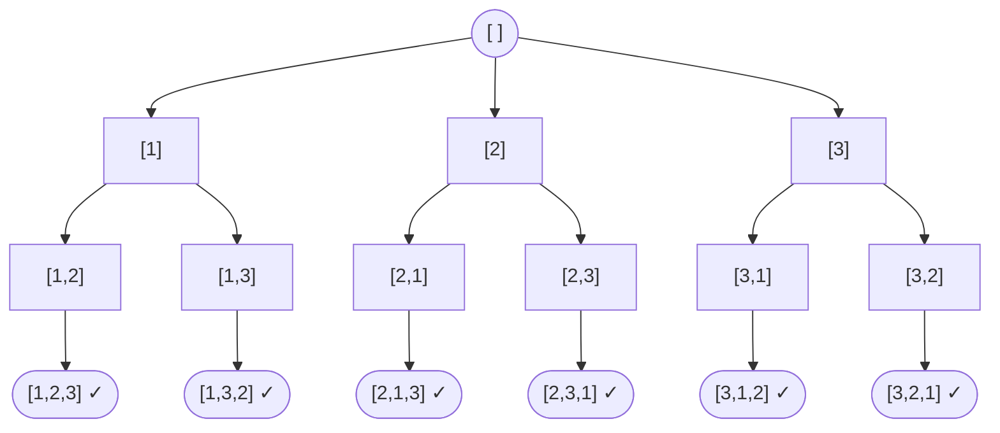
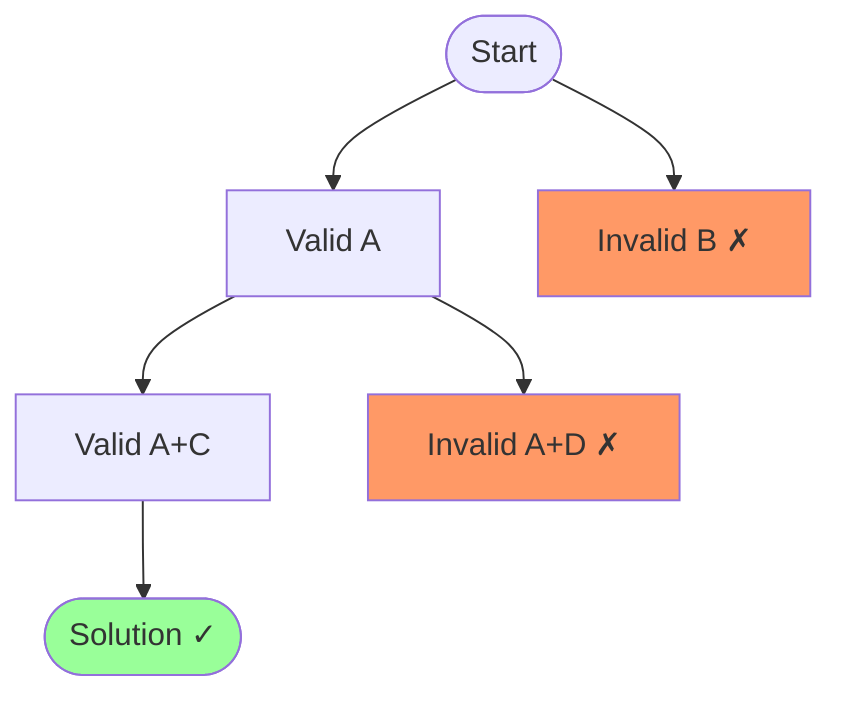

# Backtracking

A brute-force approach that builds candidates incrementally, abandoning a candidate ("backtracking") as soon as it determines the candidate cannot lead to a valid solution.

**Use when:** no greedy or DP solution exists, and you need to explore all configurations — permutations, combinations, subsets, constraint satisfaction.

**Time:** O(k^N) or O(k!) depending on branching factor — **Space:** O(N) recursion depth

---

## How It Works

At each step, make a choice. If the choice leads to an invalid state, undo it and try the next option. This is a depth-first search over a decision tree where invalid branches are pruned early.



*All permutations of [1,2,3] — each level makes one choice.*

---

## Template

```cpp
void backtrack(params, current, result) {
    if (base case — valid solution) {
        result.push(current);
        return;
    }
    for (each choice) {
        if (choice is valid) {
            apply(choice);
            backtrack(params, current, result);
            undo(choice);               // backtrack
        }
    }
}
```

---

## Pruning

Skip branches that cannot lead to a solution before exploring them — this is what separates backtracking from pure brute force.



---

## Classic Problems

| Problem | Key Constraint | Complexity |
|---|---|---|
| Permutations | each element used once | O(n!) |
| Subsets | any combination | O(2^n) |
| N-Queens | no two queens attack each other | O(n!) |
| Sudoku solver | 1-9 per row/col/box | O(9^m) |
| Word search | follow adjacent cells | O(n × 4^L) |

---

## Backtracking vs DP vs Greedy

| | Backtracking | DP | Greedy |
|---|---|---|---|
| Explores all options | Yes (with pruning) | No — reuses subproblems | No — one pass |
| Guarantees optimal | Yes (exhaustive) | Yes | Sometimes |
| Use when | enumeration, constraints | overlapping subproblems | greedy choice property holds |
