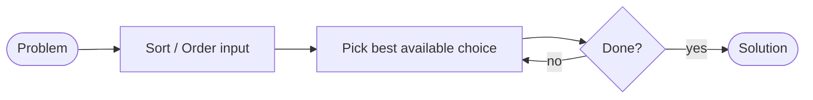
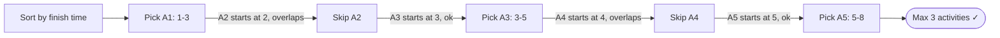

# Greedy Algorithm

Makes the locally optimal choice at each step, hoping it leads to a globally optimal solution. Fast and simple — but only correct when the problem has the right properties.

**Use when:**
1. **Greedy choice property** — a locally optimal choice is always part of a globally optimal solution
2. **Optimal substructure** — an optimal solution contains optimal solutions to subproblems

---

## How It Works

No backtracking. No revisiting choices. One pass.

---

## Activity Selection — Classic Example

Given activities with start and end times, select the maximum number of non-overlapping activities.

**Greedy choice:** always pick the activity that finishes earliest — leaves the most room for future activities.

---

## Common Greedy Problems

| Problem | Greedy Choice | Why it works |
|---|---|---|
| Activity selection | Earliest finish time | Leaves most room for future |
| Fractional knapsack | Best value/weight ratio first | Maximises value per unit weight |
| Huffman coding | Merge two lowest-freq nodes | Minimises total encoding length |
| Dijkstra | Nearest unvisited node | Non-negative weights guarantee finality |
| Kruskal's MST | Cheapest edge that doesn't form cycle | Greedy edge always safe for MST |
| Prim's MST | Cheapest edge from current tree | Same reasoning as Kruskal's |
| Coin change (canonical) | Largest denomination first | Only works for specific coin systems |

---

## Greedy vs DP

| | Greedy | DP |
|---|---|---|
| Makes choices | Once, irrevocably | After evaluating all subproblems |
| Backtracks | No | No (but considers all options) |
| Speed | Usually O(n log n) | Usually O(n²) or O(n×m) |
| Correctness | Only when greedy property holds | Always (given correct recurrence) |
| Example | Activity selection | 0/1 Knapsack |

> **Tip:** if the greedy choice property is unclear, try DP first. If DP solution can be simplified by always picking the same direction, it's likely greedy.
