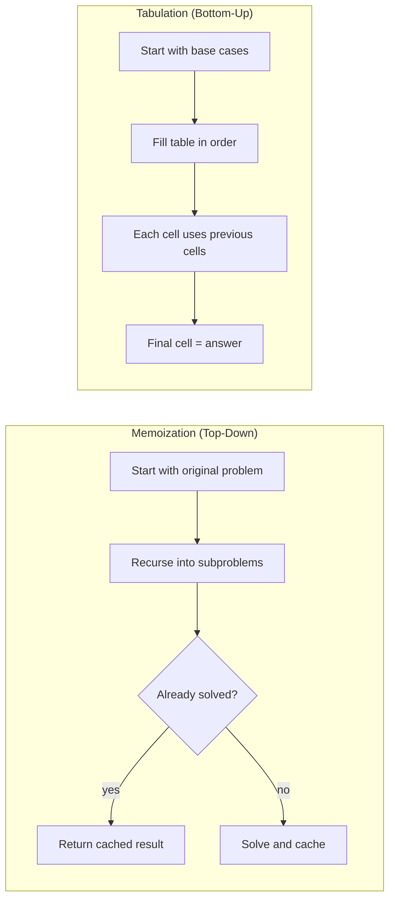
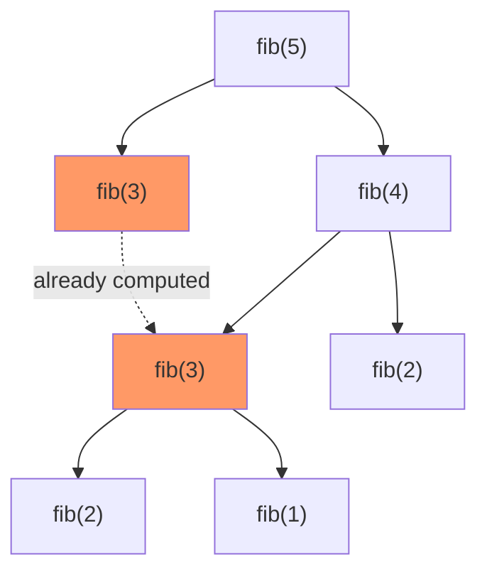
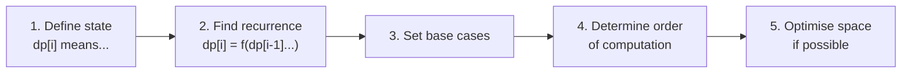

# Dynamic Programming

Solves problems by breaking them into overlapping subproblems, solving each once, and storing the result. Applies when a problem has:

1. **Optimal substructure** — optimal solution built from optimal sub-solutions
2. **Overlapping subproblems** — same subproblems solved repeatedly

---

## Two Approaches



| | Memoization | Tabulation |
|---|---|---|
| Direction | Top-down (recursive) | Bottom-up (iterative) |
| Solves | Only needed subproblems | All subproblems |
| Stack overhead | Yes (recursion) | No |
| Space optimisation | Harder | Easier |

---

## Example — Fibonacci

**Naive recursion:** O(2^n) — recomputes same values repeatedly.



**Memoization:** cache results — O(n) time, O(n) space.

```cpp
unordered_map<int, int> memo;
int fib(int n) {
    if (n <= 1) return n;
    if (memo.count(n)) return memo[n];
    return memo[n] = fib(n-1) + fib(n-2);
}
```

**Tabulation:** fill array left to right — O(n) time, O(n) space.

```cpp
int fib(int n) {
    vector<int> dp(n+1);
    dp[0] = 0; dp[1] = 1;
    for (int i = 2; i <= n; i++)
        dp[i] = dp[i-1] + dp[i-2];
    return dp[n];
}
```

**Space optimised:** only keep last two values — O(1) space.

```cpp
int fib(int n) {
    int a = 0, b = 1;
    for (int i = 2; i <= n; i++) {
        int c = a + b;
        a = b; b = c;
    }
    return b;
}
```

---

## Steps to Solve a DP Problem



---

## Classic Problems

| Problem | State | Recurrence |
|---|---|---|
| Fibonacci | dp[i] = ith number | dp[i] = dp[i-1] + dp[i-2] |
| 0/1 Knapsack | dp[i][w] = max value with i items, capacity w | max(skip, take) |
| Longest Common Subsequence | dp[i][j] = LCS of s1[0..i], s2[0..j] | match or max(skip either) |
| Longest Increasing Subsequence | dp[i] = LIS ending at i | max(dp[j]+1) for j < i, s[j] < s[i] |
| Coin Change | dp[i] = min coins for amount i | min(dp[i - coin] + 1) |
| Edit Distance | dp[i][j] = edits to convert s1[0..i] to s2[0..j] | insert/delete/replace |

---

## Space Optimisation Pattern

Most 2D DP tables can be reduced to 1D or two variables if each row only depends on the previous row.

```
// 2D: O(n×m) space
dp[i][j] = dp[i-1][j] + dp[i][j-1]

// 1D: O(m) space — reuse same row
dp[j] = dp[j] + dp[j-1]
```
