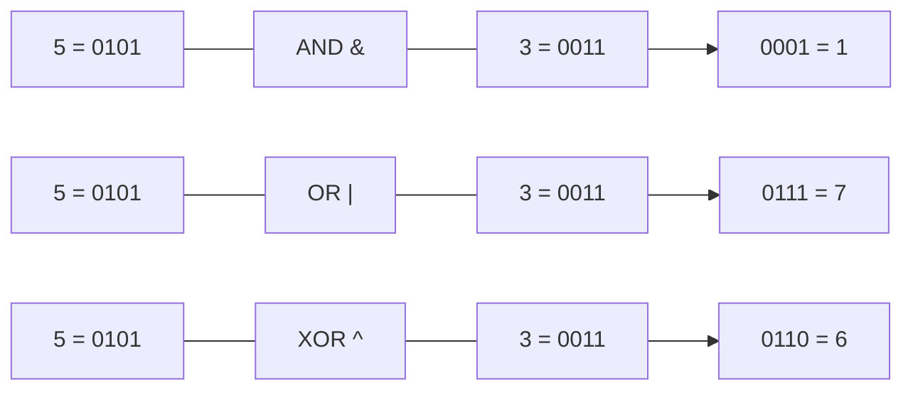
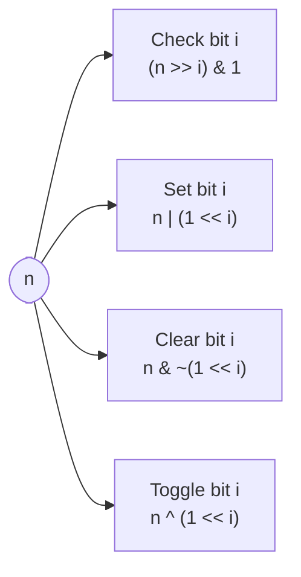
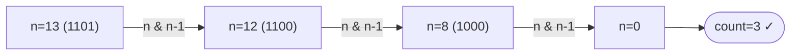

# Bit Manipulation

Operates directly on binary representations of integers. Extremely fast (single CPU instruction) and useful for space-efficient solutions.

---

## Operators

| Operator    | Symbol | Rule                  | Example (5=0101, 3=0011) |
|-------------|--------|-----------------------|--------------------------|
| AND         | `&`    | 1 if both bits are 1  | 5 & 3 = 0001 = **1**     |
| OR          | `\|`   | 1 if any bit is 1     | 5 \| 3 = 0111 = **7**    |
| XOR         | `^`    | 1 if exactly one is 1 | 5 ^ 3 = 0110 = **6**     |
| NOT         | `~`    | flip all bits         | ~5 = ...11111010 = **-6** |
| Left shift  | `<<`   | shift left, fill 0s   | 5 << 1 = 1010 = **10**   |
| Right shift | `>>`   | shift right, fill 0s  | 5 >> 1 = 0010 = **2**    |



> Left shift by n = multiply by 2^n. Right shift by n = divide by 2^n (integer).

---

## Common Tricks



| Operation | Code | Notes |
|---|---|---|
| Check if bit i is set | `(n >> i) & 1` | Returns 1 or 0 |
| Set bit i | `n \| (1 << i)` | Forces bit to 1 |
| Clear bit i | `n & ~(1 << i)` | Forces bit to 0 |
| Toggle bit i | `n ^ (1 << i)` | Flips the bit |
| Check if power of 2 | `n & (n-1) == 0` | Power of 2 has exactly one set bit |
| Clear lowest set bit | `n & (n-1)` | Used in counting set bits |
| Get lowest set bit | `n & (-n)` | Isolates the rightmost 1 |
| Swap two numbers | `a^=b; b^=a; a^=b` | XOR swap, no temp variable |

---

## Count Set Bits — Brian Kernighan's Algorithm

Repeatedly clears the lowest set bit until n = 0. Runs in O(number of set bits).

```cpp
int countBits(int n) {
    int count = 0;
    while (n) {
        n &= (n - 1);   // clear lowest set bit
        count++;
    }
    return count;
}
```



---

## XOR Properties

XOR has powerful properties useful in many problems:

| Property | Expression |
|---|---|
| Self-inverse | `a ^ a = 0` |
| Identity | `a ^ 0 = a` |
| Commutative | `a ^ b = b ^ a` |
| Associative | `(a^b)^c = a^(b^c)` |

**Common use:** find the single non-duplicate in an array of pairs — XOR all elements, duplicates cancel out.

```cpp
int singleNumber(vector<int>& nums) {
    int res = 0;
    for (int n : nums) res ^= n;
    return res;
}
```

---

## Common Problems

| Problem | Technique |
|---|---|
| Single non-duplicate | XOR all elements |
| Check power of 2 | `n & (n-1) == 0` |
| Count set bits | Brian Kernighan's |
| Reverse bits | Shift and OR |
| Two non-duplicates | XOR + partition by differing bit |
| Subset generation | Use bitmask 0..2^n-1 |
