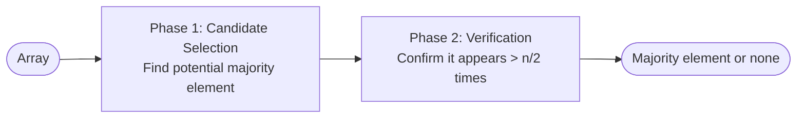
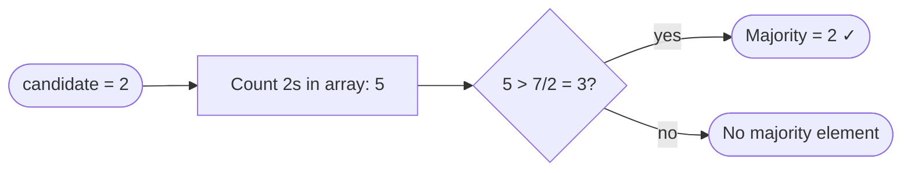

# Moore Voting Algorithm

Finds the **majority element** — an element that appears more than ⌊n/2⌋ times — in O(n) time and O(1) space.

**Key insight:** if you pair every majority element occurrence with a different element, the majority element still survives because it has more than half the votes.

- **Time:** O(n) — two passes
- **Space:** O(1)

---

## Two Phases



---

## Phase 1 — Candidate Selection

Traverse the array maintaining a `candidate` and a `count`. Think of it as a vote: same element adds a vote, different element cancels one. If count hits 0, reset to current element.

```mermaid
flowchart LR
    A["2,2,1,1,2,2,2"] -->|"count=0 → candidate=2, cnt=1"| B["c=2 cnt=1"]
    B -->|"2==2, cnt++"| C["c=2 cnt=2"]
    C -->|"1!=2, cnt--"| D["c=2 cnt=1"]
    D -->|"1!=2, cnt--"| E["c=2 cnt=0"]
    E -->|"count=0 → candidate=2, cnt=1"| F["c=2 cnt=1"]
    F -->|"2==2, cnt++"| G["c=2 cnt=2"]
    G -->|"2==2, cnt++"| H["c=2 cnt=3"]
    H --> I(["candidate = 2"])
```



---

## Phase 2 — Verification

Count actual occurrences of the candidate. Necessary because Phase 1 only guarantees a *potential* majority element — if no majority exists, Phase 1 still produces a candidate.



---

## Implementation

```cpp
int majorityElement(vector<int>& nums) {
    int candidate = 0, count = 0;

    // Phase 1: candidate selection
    for (int num : nums) {
        if (count == 0) candidate = num;
        count += (num == candidate) ? 1 : -1;
    }

    // Phase 2: verification
    count = 0;
    for (int num : nums) {
        if (num == candidate) count++;
    }

    return count > nums.size() / 2 ? candidate : -1;
}
```

---

## Why It Works

Imagine each majority element fights a different element — they cancel out in pairs. Since the majority element appears more than n/2 times, it cannot be fully cancelled. At least one occurrence survives as the final candidate.

| Step | Intuition |
|---|---|
| Same element → count++ | Building a coalition |
| Different element → count-- | Opposition cancels one vote |
| count = 0 → reset | Previous coalition fully cancelled, start fresh |
| Surviving candidate | Has more votes than all opposition combined |

---

## Variants

- **Majority > n/3** — can have at most 2 such elements. Use two candidates and two counters (Boyer-Moore extended).
- **Majority > n/4** — use three candidates.
