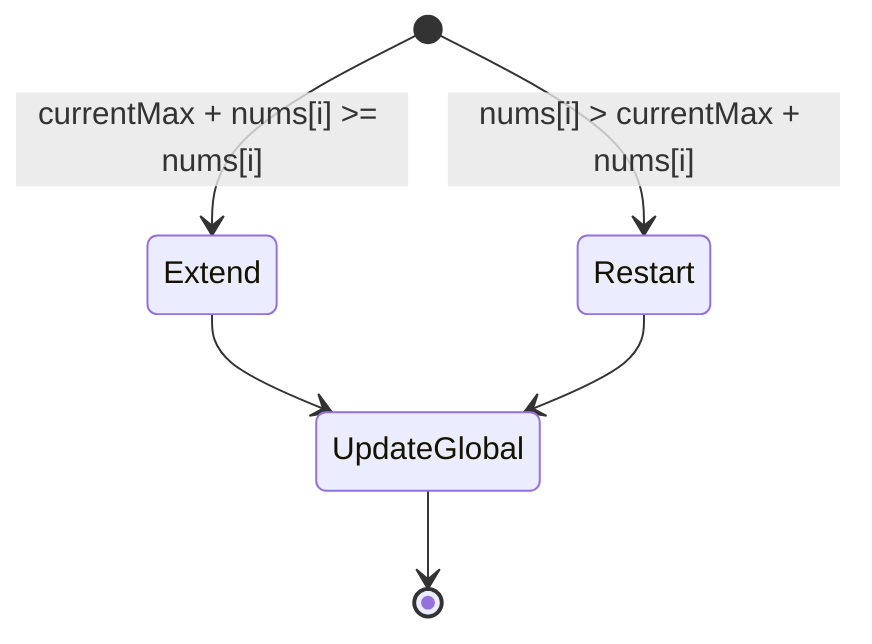

# Kadane's Algorithm

Finds the **maximum sum contiguous subarray** in O(n) time and O(1) space.

## Intuition

At each index, decide:
- **extend** the existing subarray (`currentMax + nums[i]`)
- **start fresh** from here (`nums[i]`)

whichever is larger becomes the new `currentMax`. Track the global best.

## Algorithm

```
currentMax = nums[0]
globalMax  = nums[0]

for i = 1 to n-1:
    currentMax = max(nums[i], currentMax + nums[i])
    globalMax  = max(globalMax, currentMax)

return globalMax
```

## Step-by-step trace

Array: `[-2, 1, -3, 4, -1, 2, 1, -5, 4]`

| i | nums[i] | currentMax | globalMax |
|---|---------|-----------|-----------|
| 0 | -2      | -2        | -2        |
| 1 |  1      |  1        |  1        |
| 2 | -3      | -2        |  1        |
| 3 |  4      |  4        |  4        |
| 4 | -1      |  3        |  4        |
| 5 |  2      |  5        |  5        |
| 6 |  1      |  6        |  6        |
| 7 | -5      |  1        |  6        |
| 8 |  4      |  5        |  6        |

**Answer: 6** → subarray `[4, -1, 2, 1]`

## State machine view



## C++ Implementation

```cpp
#include <bits/stdc++.h>
using namespace std;

int maxSubarraySum(vector<int>& nums) {
    int currentMax = nums[0];
    int globalMax  = nums[0];

    for (int i = 1; i < nums.size(); i++) {
        currentMax = max(nums[i], currentMax + nums[i]);
        globalMax  = max(globalMax, currentMax);
    }
    return globalMax;
}
```

### With subarray indices

```cpp
pair<int, pair<int,int>> maxSubarrayWithIndices(vector<int>& nums) {
    int cur = nums[0], best = nums[0];
    int start = 0, end = 0, tempStart = 0;

    for (int i = 1; i < (int)nums.size(); i++) {
        if (nums[i] > cur + nums[i]) {
            cur = nums[i];
            tempStart = i;
        } else {
            cur += nums[i];
        }
        if (cur > best) {
            best  = cur;
            start = tempStart;
            end   = i;
        }
    }
    return { best, { start, end } };
}
```

## Complexity

| | |
|---|---|
| Time  | O(n) — single pass |
| Space | O(1) |

## Variants

| Variant | Twist |
|---------|-------|
| **Maximum product subarray** | Track both max and min (negatives flip sign) |
| **Circular subarray max sum** | `max(kadane(arr), totalSum - kadane(minSubarray))` |
| **At least k elements** | Sliding window + prefix sums |
| **All subarrays with sum > 0** | Variant using prefix sum + monotonic queue |

## Common pitfalls

- Initialising `currentMax = 0` breaks for all-negative arrays — use `nums[0]`
- Works only on 1-D arrays; 2-D variant requires reducing columns with prefix sums
