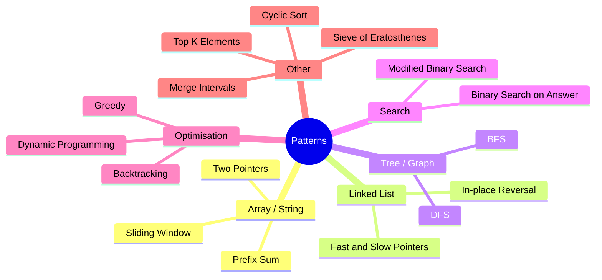
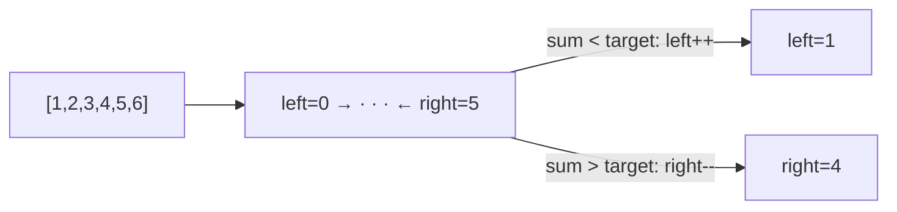
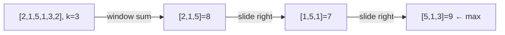
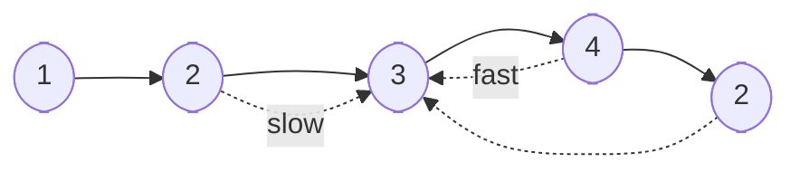
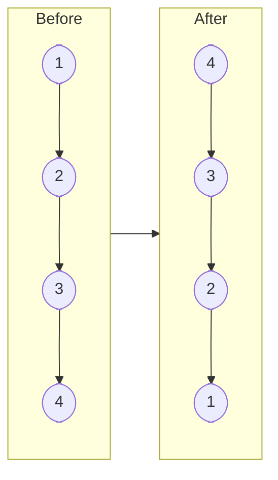
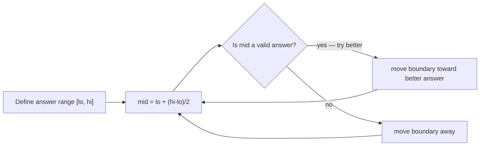
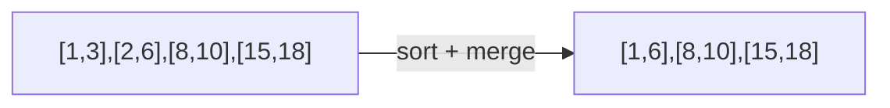
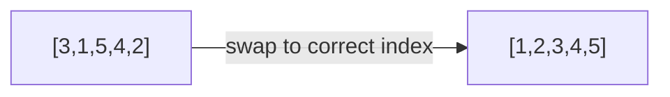
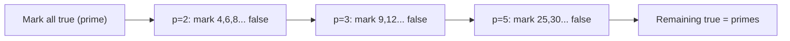

# Problem Solving Patterns

Recognising the right pattern is the key to solving interview problems quickly. Most problems are variations of a small set of patterns.



---

## Two Pointers

Use two indices moving toward or away from each other. Eliminates the need for nested loops.



**Use when:** sorted array, pair/triplet sum, palindrome check, container with most water.

---

## Sliding Window

Maintain a window of elements that satisfies a condition. Expand right, shrink left.



**Use when:** contiguous subarray/substring with condition (max sum, unique chars, at most k distinct).

---

## Fast & Slow Pointers

Two pointers at different speeds. If a cycle exists, they will meet.



**Use when:** detect cycle in linked list, find middle node, find cycle entry point.

---

## In-place Reversal (Linked List)

Reverse a linked list or sublist by redirecting pointers — no extra space.



**Use when:** reverse a list, reverse a sublist between positions i and j, rotate list.

---

## BFS — Level Order / Shortest Path

Process nodes level by level using a queue.

**Use when:** shortest path in unweighted graph, level-order tree traversal, minimum steps problems.

---

## DFS — Explore All Paths

Explore as deep as possible using recursion or a stack.

**Use when:** path existence, connected components, topological sort, island counting.

---

## Binary Search on Answer

Instead of searching for a value, binary search on the **answer space**.



**Use when:** minimise the maximum, maximise the minimum, capacity to ship, koko eating bananas.

---

## Merge Intervals

Sort intervals by start time, then merge overlapping ones in a single pass.



**Use when:** meeting rooms, insert interval, employee free time.

---

## Top K Elements

Use a min-heap of size k to track the k largest elements efficiently.

- Maintain heap of size k: if new element > heap top, pop and push
- **Time:** O(n log k) vs O(n log n) for full sort

**Use when:** k closest points, k most frequent elements, k largest in stream.

---

## Cyclic Sort

For arrays containing numbers in range [1, n] — place each number at its correct index in O(n).



**Use when:** find missing/duplicate numbers, first missing positive.

---

## Prefix Sum

Precompute cumulative sums to answer range sum queries in O(1).

```
arr:    [1, 2, 3, 4, 5]
prefix: [1, 3, 6, 10, 15]
sum(i,j) = prefix[j] - prefix[i-1]
```

**Use when:** range sum queries, subarray sum equals k, product of array except self.

---

## Sieve of Eratosthenes

Find all primes up to n in O(n log log n) by marking multiples of each prime as composite.



```cpp
vector<bool> sieve(int n) {
    vector<bool> prime(n+1, true);
    prime[0] = prime[1] = false;
    for (int p = 2; p * p <= n; p++)
        if (prime[p])
            for (int m = p*p; m <= n; m += p)
                prime[m] = false;
    return prime;
}
```

[LeetCode — Count Primes](https://leetcode.com/problems/count-primes/)
