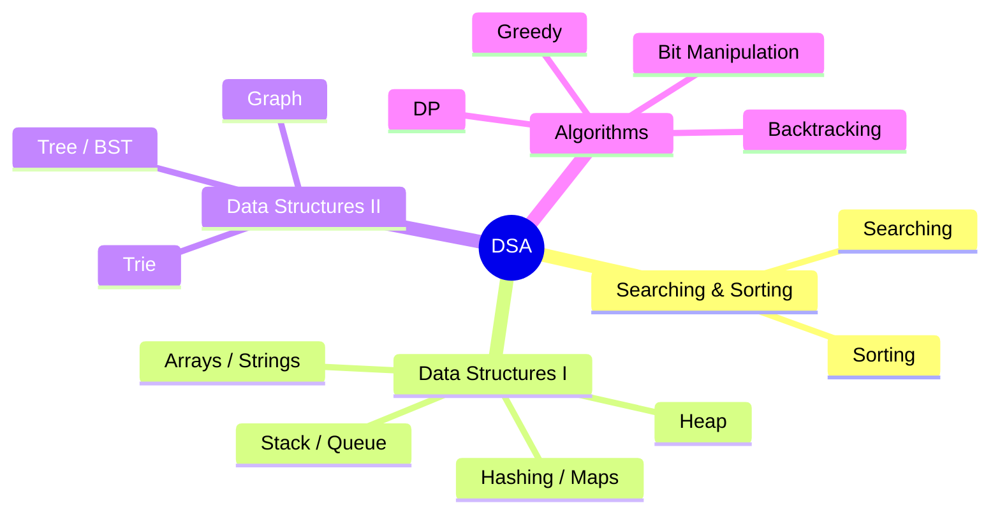

- [Searching Algo](/theory/01-searching/01-search-algo.md)
- [Sorting Algo](/theory/02-sorting/01-sort-algo.md)
- [Data Structures - I](/theory/03-data-structures-1/01-data-structure.md#data-structures)
  - [Arrays](/theory/03-data-structures-1/01-data-structure.md#arrays)
  - [Linked List](/theory/03-data-structures-1/01-data-structure.md#linked-list)
  - [Strings](/theory/03-data-structures-1/01-data-structure.md#strings)
  - [Stack](/theory/03-data-structures-1/01-data-structure.md#stack)
  - [Queues](/theory/03-data-structures-1/01-data-structure.md#queues)
  - [Hashing](/theory/03-data-structures-1/01-data-structure.md#hashing)
  - [Maps  (map, set)](/theory/03-data-structures-1/01-data-structure.md#maps--map-set)
  - [Heap](/theory/03-data-structures-1/02-heap.md)
- [Data Structures - II](/theory/04-data-structures-2/)
  - [Tree](/theory/04-data-structures-2/01-tree.md)
  - [Binary Search Tree](/theory/04-data-structures-2/02-binary-search-tree.md)
  - [Graph](/theory/04-data-structures-2/03-graph/01-graph.md)
    - [Cycle Detection](/theory/04-data-structures-2/03-graph/02-cycle-detection.md)
    - [Topological Sort](/theory/04-data-structures-2/03-graph/03-topological-sort.md)
    - [Shortest Path](/theory/04-data-structures-2/03-graph/04-shortest-path.md)
    - [MST](/theory/04-data-structures-2/03-graph/05-mst.md)
    - [Kahn's Algorithm](/theory/04-data-structures-2/03-graph/06-kahns-algorithm.md)
  - [Trie](/theory/04-data-structures-2/04-trie.md)
- Algo - I
  - [Backtracking](/theory/05-algo-1/01-backtracking.md)
  - [Greedy](/theory/05-algo-1/02-greedy.md)
  - [DP](/theory/05-algo-1/03-dp.md)
- Algo - II
  - [Bit Manipulation](/theory/06-algo-2/01-bit-manipulation.md)
  - [Moore Voting Algorithm](/theory/06-algo-2/02-moore-voting-algo.md)
- Patterns
  - [Patterns](/theory/07-patterns/01-patterns.md)
- Other
  - [C++ STL](/theory/08-other/01-cpp-stl.md)
  - [Other Notes](/theory/08-other/02-other-notes.md)
