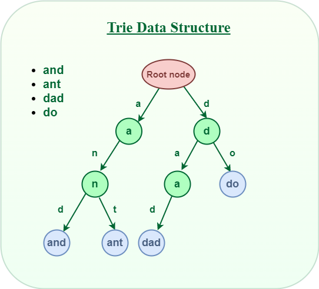
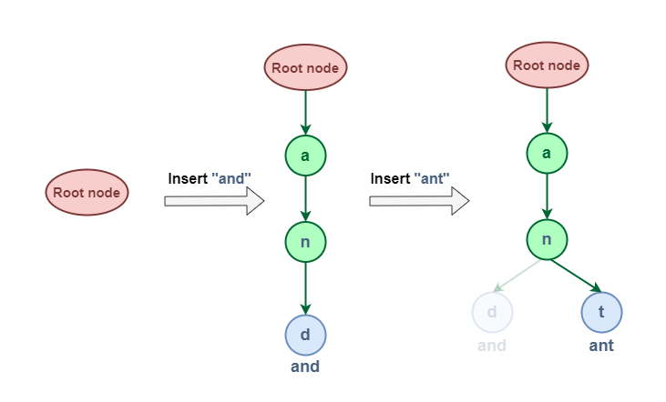
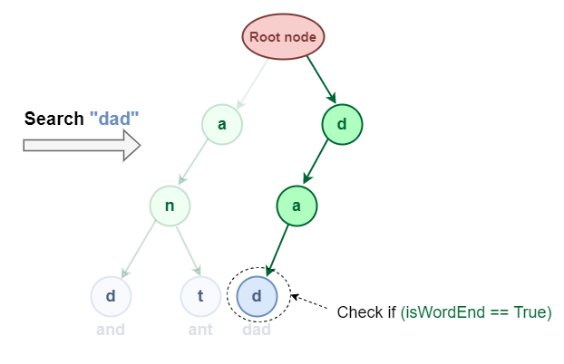

This data structure is used for optimised search and insertion.

### Node Structure

- Node -> It represents a single character and contians all the children nodes
- Children -> Each node has multiple children node representing one of possible characters that comes after. 
- isEndofWrod -> Represents if node is a end of word. 
- SC - O(ALPHABET_SIZE * m * n)
  - m -> total no of word
  - n -> avg length of word



```c++
class Node{
    int countEndWith = 0;
    int countPrefix = 0;
    vector<Node*> nodeV;
};
```

### Insertion
TC - O(world length)


### Search 
TC - O(world length)

